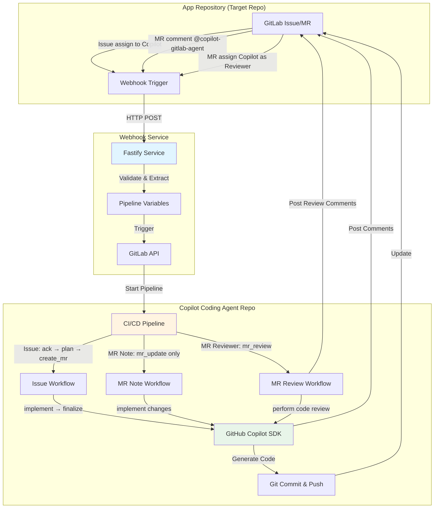

# Copilot Coding Agent for GitLab

[English](README.md) | [中文](docs/README_CN.md) | [日本語](docs/README_JA.md) | [हिन्दी](docs/README_HI.md) | [한국어](docs/README_KO.md) | [ภาษาไทย](docs/README_TH.md) | [العربية](docs/README_AR.md)

A fully automated coding agent powered by GitHub Copilot SDK and GitLab CI/CD. This system enables autonomous code implementation and intelligent code review through issue assignments, merge request comments, and MR reviewer assignments.

## Demo and Examples

**YouTube Demo Videos**

Setup:
- [Copilot Coding Agent for GitLab - Setup Guide](https://www.youtube.com/watch?v=aSQVP1AAD60)

How to Use:
- [Copilot Coding Agent for GitLab - How to use 2:30 – Create an issue in the app repo and assign it to Copilot](https://www.youtube.com/watch?v=med7Bfff_m4&t=150s)
- [Copilot Coding Agent for GitLab - How to use 11:24 – Let Copilot make some updates in the merge request via comments](https://www.youtube.com/watch?v=med7Bfff_m4&t=684s)

**Example Repository**
- Public GitLab demo repo [app-repo-01](https://gitlab.com/agentic-devops/app-repo-01)
- Issue: [Webhook receiver application](https://gitlab.com/agentic-devops/app-repo-01/-/issues/23)
- Merge Request: [Webhook receiver application (#23)](https://gitlab.com/agentic-devops/app-repo-01/-/merge_requests/28)
- MR update by comment: [@copilot-gitlab-agent edit readme to Arabic](https://gitlab.com/agentic-devops/app-repo-01/-/merge_requests/28#note_2935174921)
- Code review: [Assign Copilot as MR reviewer](https://gitlab.com/agentic-devops/app-repo-01/-/merge_requests/28#note_2935188042)

## Architecture



### System Components

1. **App Repository**: Your application code repository where development happens
2. **Webhook Service**: A Fastify-based relay service that captures GitLab events
3. **Copilot Coding Agent Repo**: CI/CD orchestrator that runs coding automation

### Workflow Overview

**Issue Assignment Workflow** (full automation):
```
Issue assigned to Copilot → Webhook → Pipeline trigger →
Acknowledge issue → Generate TODO plan → Create MR →
Implement code → Push changes → Update MR and issue
```

**MR Comment Workflow** (quick updates):
```
Comment @copilot-gitlab-agent in MR → Webhook → Pipeline trigger →
Acknowledge → Implement changes → Push to source branch →
Post summary comment
```

**MR Reviewer Workflow** (intelligent code review):
```
Assign Copilot as MR reviewer → Webhook → Pipeline trigger →
Acknowledge → Analyze code changes → Perform comprehensive review →
Post detailed review comment
```

## Prerequisites

### Required Tools
- **GitLab Account** with API access
- **GitLab Runner (Docker/Kubernetes executor)** (for CI/CD execution)
- **GitHub Copilot** subscription (for SDK API access)
- **Docker** (optional, for running webhook service in a container)

### Required Permissions
- **App Repository**: Maintainer role (for receiving webhooks and creating MRs)
- **Copilot Coding Agent Repository**: Owner role (for CI/CD configuration)
- **GitLab Personal Access Token** with scopes:
  - `api` (full API access)
  - `read_repository`
  - `write_repository`

## Admin Setup Guide

### Step 1: Create a Copilot Bot User (optional but recommended)

> It is suggested to create a dedicated GitLab user account for the Copilot agent for better permission management and activity auditing. You can use an existing account, but this is not recommended.

1. Create a new GitLab account named "Copilot" or similar
2. Create a personal access token for this account:
   - Go to **User Settings** → **Personal Access Tokens**
   - Token name: `copilot-automation`
   - Scopes: Select all scopes (or at minimum: `api`, `read_repository`, `write_repository`)
   - Save the token securely
   

3. Grant appropriate permissions to this user (choose one approach):
   - **Option A (recommended for org-wide use)**: Assign as GitLab **Administrator** or group **Owner**
     - This allows the Copilot user to access all repositories in the GitLab instance or group
     - More suitable for managing multiple projects
   - **Option B (recommended for limited scope)**: Add as a member to specific app repositories
     - Role: **Developer** or **Maintainer**
     - More granular control, suitable if you prefer restricted access
   - This user will be assigned to issues and create merge requests

### Step 2: Setup Copilot Coding Agent Repository

> Using Copilot user operations

1. **Import this repository to your GitLab via Git URL**
   - Use the Copilot user created in Step 1 as the repository owner, then import the repository to GitLab:
     ```bash
     https://github.com/trycatchkamal/gitlab-copilot-agent.git
     ```
     
     
     
   - The visibility of the newly imported repository should be set to Internal
     

2. **Configure CI/CD Variables**

   Go to **Settings** → **CI/CD** → **Variables**, add the following:

   | Variable | Description | Protected | Masked |
   |----------|-------------|-----------|--------|
   | `GITLAB_TOKEN` | Personal access token (from Step 1) | Yes | Yes |
   | `GITHUB_TOKEN` | GitHub personal access token with Copilot permissions | Yes | Yes |

   To create `GITHUB_TOKEN` — a fine-grained personal access token with "Copilot Requests" permission enabled:
   - Visit https://github.com/settings/personal-access-tokens/new
   - Under "Permissions", click "add permissions" and select "Copilot Requests"
   - Create your token
   

   

   Remember to change the role that can use pipeline variables to Developer
   

3. **Setup GitLab Runner**
   > If your GitLab instance already has available Runners with Docker/Kubernetes executors, you can skip this step.

   Ensure you have a GitLab Runner configured with:
   - Docker executor (recommended)
   - Access to Docker image: `node:20-alpine`

   If using tags, ensure the Runner has corresponding tags, or update `.gitlab-ci.yml` as needed. New Runner registration can be completed following GitLab's page guidance, and can be registered at project or group level. Here is an example for project level:
   

### Step 3: Deploy Webhook Service

1. **Create `.env` file**
   ```bash
   cat > .env << EOF
   PIPELINE_TRIGGER_TOKEN=your-trigger-token, generated in Settings → CI/CD → Pipeline trigger tokens of the repository created in Step 2
   PIPELINE_PROJECT_ID=your-project-id, project ID of this repository (found in Settings → General)
   PIPELINE_REF=main
   GITLAB_API_BASE=https://gitlab.com # Change to self-hosted instance if needed
   WEBHOOK_SECRET_TOKEN=
   COPILOT_AGENT_USERNAME=copilot-gitlab-agent # GitLab ID of Copilot bot
   COPILOT_AGENT_COMMIT_EMAIL=33458317-copilot-gitlab-agent@users.noreply.gitlab.com # Email for git commits
   LISTEN_HOST=0.0.0.0
   LISTEN_PORT=8080
   ENABLE_INLINE_REVIEW_COMMENTS=true
   COPILOT_LANGUAGE=en
   COPILOT_MODEL=gpt-4.1
   EOF
   ```

   - `PIPELINE_TRIGGER_TOKEN`: Generated in **Settings** → **CI/CD** → **Pipeline trigger tokens** of the repository created in Step 2
   
   - `PIPELINE_PROJECT_ID`: Project ID of this repository (found in **Settings** → **General**)
   
   - `COPILOT_AGENT_USERNAME`: GitLab ID of the Copilot bot user created in Step 1
   

2. **Run with Docker**
   ```bash
   docker run -itd \
     --name gitlab-copilot-agent \
     -p 8080:8080 \
     --env-file .env \
     --restart unless-stopped \
     trycatchkamal/gitlab-copilot-agent:latest
   ```
3. **Run from Source (optional)**
   ```bash
   git clone https://github.com/trycatchkamal/gitlab-copilot-agent.git
   cd gitlab-copilot-agent/
   pnpm install
   pnpm build
   pnpm start
   ```
4. **Hook URL**
   Get the public URL of the webhook service, e.g.:
   - `http://your-server-ip:8080/gitlab-events`

### Step 4: Configure Webhooks in App Repository

> Generally, developers who want to use the Copilot coding agent only need to configure the webhook in their app repository, without needing access to the Copilot coding agent repository.

1. Go to your **App Repository** → **Settings** → **Webhooks**

2. **Create Webhook**
   - URL: `http://your-server-ip:8080/gitlab-events`
   - Secret Token: (same as `WEBHOOK_SECRET_TOKEN`)
   - Trigger: Check **Issues events**, **Comments** (note events), and **Merge request events**
   - Click **Add webhook**
   

3. **Test the webhook**
   - Click **Test** → **Issue events**
   - Check webhook service logs for successful receipt
   - Verify HTTP 200/202 response

### Step 5: Verification

1. **Test Issue Assignment**
   - Create a test issue in the app repository
   - Assign it to the Copilot user
   
   - Watch the CI/CD pipeline trigger in the Copilot Coding Agent repository
   
   - Verify MR creation and code implementation
   
   

2. **Test MR Comment**
   - Create a test MR in the app repository
   - Comment: `@copilot-gitlab-agent add a hello world function`
   
   - Verify pipeline execution and code changes
   

3. **Test MR Reviewer**
   - Create or open a test MR in the app repository, assign the Copilot user as a reviewer
   
   - Verify pipeline execution and review comment posting, check the detailed code review report posted by Copilot
   

4. **Check Logs**
   ```bash
   # Webhook service logs
   docker logs -f gitlab-copilot-agent

   # Inspect persisted webhook payloads
   ls -la hooks/

   # Inspect pipeline logs
   # Go to Copilot Coding Agent repository → CI/CD → Pipelines
   ```

## User Guide

### For Developers: Using Issue Assignment

1. **Create an Issue** in your app repository
   ```markdown
   ## Requirements
   - Implement user authentication
   - Add password encryption
   - Create login endpoint
   - Add JWT token generation
   ```

2. **Assign to Copilot**
   - On the issue page, assign it to the "Copilot" user
   - The system will start working automatically

3. **Track Progress**
   - Copilot posts an acknowledgment comment with pipeline link
   - A merge request is created with a TODO checklist
   - Code is implemented automatically
   - Final comment notifies of completion

   > **Note**: If a merge request already exists for the issue, Copilot will detect it and post a notification in the issue, asking you to continue work in the existing MR instead of creating a duplicate.

4. **Review and Merge**
   - Review the generated code in the MR
   - Request changes if needed (see MR Comment usage below)
   - Approve and merge when satisfied

### For Developers: Using MR Comment Commands

1. **In an existing MR**, add a comment:
   ```
   @copilot-gitlab-agent add error handling to the login function
   ```

2. **Supported Instructions**
   - Add features: `@copilot-gitlab-agent add unit tests for authentication`
   - Fix bugs: `@copilot-gitlab-agent fix the null pointer exception in line 45`
   - Refactor: `@copilot-gitlab-agent refactor the user service to use dependency injection`
   - Update: `@copilot-gitlab-agent update dependencies to latest versions`

3. **Copilot will**:
   - Acknowledge your request
   - Implement the changes
   - Commit and push to the MR branch
   - Post a summary of changes

### For Developers: Using MR Reviewer for Code Review

1. **On the MR page**, assign the Copilot user as a reviewer
   - Find the "Reviewers" option on the right side of the MR page
   - Select the Copilot user (e.g., copilot-gitlab-agent)

2. **Copilot will**:
   - Automatically trigger the code review workflow
   - Analyze all code changes between source and target branches
   - Perform a comprehensive code review covering:
     - Code quality and maintainability
     - Best practices and design patterns
     - Security vulnerability checks
     - Performance analysis
     - Test coverage assessment
     - Documentation completeness
   - Post a detailed review report in the MR, categorized by severity
   - Provide specific improvement suggestions and recommended fixes

3. **Review Report Contents**:
   - Overall assessment summary
   - Issues categorized by severity (critical, major, minor, suggestions)
   - Each issue includes file location, detailed description, and fix recommendations
   - Final review recommendation: APPROVE, REQUEST_CHANGES, or NEEDS_DISCUSSION

### Best Practices

**Writing Effective Issue Descriptions**:
- Be specific about requirements
- Include acceptance criteria
- Provide context and examples
- Use checklists for multiple tasks

**Using MR Comment Commands**:
- One clear instruction per comment
- Reference specific files/functions when possible
- Be concise but descriptive
- Wait for completion before the next instruction

**Code Review**:
- Always review generated code
- Test the implementation
- Check for security issues
- Verify coding standards compliance

## Tech Stack

- **Runtime**: Node.js 20+
- **Framework**: Fastify 5
- **Language**: TypeScript (strict mode)
- **AI SDK**: @github/copilot-sdk
- **Validation**: Zod
- **Testing**: Jest + ts-jest
- **HTTP Client**: Undici (native Node.js fetch)
- **Git Operations**: simple-git
- **GitLab API**: @gitbeaker/rest
- **Logging**: Pino
- **i18n**: 7 languages (en, zh, ja, hi, ko, th, ar)

## Environment Variables

| Variable | Required | Default | Description |
|----------|----------|---------|-------------|
| `PIPELINE_TRIGGER_TOKEN` | Yes | - | GitLab pipeline trigger token |
| `PIPELINE_PROJECT_ID` | Yes | - | GitLab project ID to trigger |
| `PIPELINE_REF` | No | `main` | Git ref to trigger pipeline on |
| `GITLAB_API_BASE` | No | `https://gitlab.com` | GitLab API base URL |
| `WEBHOOK_SECRET_TOKEN` | No | - | Webhook secret for validation |
| `FALLBACK_TARGET_BRANCH` | No | `main` | Default target branch |
| `ORIGINAL_NEEDS_MAX_CHARS` | No | `8192` | Max characters for issue description |
| `COPILOT_AGENT_USERNAME` | No | `copilot-gitlab-agent` | Username to watch for |
| `COPILOT_AGENT_COMMIT_EMAIL` | No | `copilot@github.com` | Email for commits |
| `ENABLE_INLINE_REVIEW_COMMENTS` | No | `true` | Enable inline MR review comments |
| `COPILOT_LANGUAGE` | No | `en` | Language for copilot responses |
| `COPILOT_MODEL` | No | `gpt-4.1` | Copilot model for code operations |
| `LISTEN_HOST` | No | `0.0.0.0` | Server listen host |
| `LISTEN_PORT` | No | `8080` | Server listen port |
| `LOG_DEBUG` | No | `false` | Enable debug logging |
| `NODE_ENV` | No | `development` | Environment mode |

## API Endpoints

### `POST /gitlab-events`

Receives GitLab webhook events and triggers CI/CD pipelines.

**Supported Events:**
- Issue Hook (when copilot agent is assigned)
- Note Hook (when copilot agent is mentioned in MR comments)
- Merge Request Hook (when copilot agent is assigned as reviewer)

**Headers:**
- `X-Gitlab-Event`: Event type
- `X-Gitlab-Token`: Webhook secret (if configured)

**Response:**
```json
{
  "status": "queued",
  "pipeline_id": 12345,
  "web_url": "https://gitlab.com/project/pipelines/12345",
  "ref": "main"
}
```

### `GET /health`

Health check endpoint.

**Response:**
```json
{
  "status": "ok",
  "timestamp": "2024-01-01T00:00:00.000Z"
}
```

## Project Structure

```
.
├── src/
│   ├── __tests__/                     # Test files
│   ├── lib/
│   │   ├── gitlab-api.ts             # GitLab API client (@gitbeaker/rest)
│   │   ├── prompt-loader.ts          # i18n prompt template loader
│   │   ├── git-helpers.ts            # Git utility functions
│   │   ├── retry.ts                  # Retry utility
│   │   ├── issue-workflow-service.ts # Issue automation service
│   │   ├── mr-update-service.ts      # MR update service
│   │   └── mr-review-service.ts      # MR code review service
│   ├── config.ts                     # Configuration with Zod validation
│   ├── types.ts                      # TypeScript types and Zod schemas
│   ├── extractors.ts                 # Variable extraction logic
│   ├── pipeline.ts                   # Pipeline trigger client
│   ├── utils.ts                      # Utility functions
│   ├── gitlab-events-handler.ts      # Main webhook handler
│   ├── index.ts                      # Application entry point (Fastify)
│   ├── issue-workflow-cli.ts         # CLI for issue workflow (used by CI/CD)
│   ├── mr-update-cli.ts              # CLI for MR updates (used by CI/CD)
│   └── mr-review-cli.ts              # CLI for MR review (used by CI/CD)
├── prompts/                          # i18n prompt templates (en, ar, hi, ja, ko, th, zh)
├── hooks/                            # Persisted webhook payloads
├── logs/                             # Application logs
└── dist/                             # Compiled JavaScript
```

## Configuration Reference

### Intermediate Files (auto-excluded from Git)

The following files are created during execution but excluded from commits:
- `patch_raw.txt` - Raw Copilot output
- `todo.md` / `todo_completed.md` - Task checklists
- `plan.json` - Implementation plan
- `commit_msg.txt` - Generated commit message
- `mr_summary.txt` - Change summary

## Development

```bash
# Install dependencies
pnpm install

# Start development server with hot reload
pnpm dev

# Run tests
pnpm test

# Run tests in watch mode
pnpm test:watch

# Generate coverage report
pnpm test:coverage

# Type checking
pnpm typecheck

# Linting
pnpm lint
pnpm lint:fix

# Format code
pnpm format

# Build for production
pnpm build

# Start production server
pnpm start
```

### Docker

```bash
# Build image
docker build -t gitlab-copilot-agent .

# Run container
docker run -p 8080:8080 --env-file .env gitlab-copilot-agent
```

## Troubleshooting

### Webhook Not Working

1. **Check webhook connectivity**
   - App Repository → Settings → Webhooks → View Recent Deliveries
   - Look for 2xx status codes

2. **Test webhook service**
   ```bash
   curl -X POST https://your-webhook-url/gitlab-events \
     -H "Content-Type: application/json" \
     -d '{"test": true}'
   ```

3. **Check logs**
   ```bash
   docker logs -f gitlab-copilot-agent
   ```

### Pipeline Not Triggering

1. Verify `PIPELINE_TRIGGER_TOKEN` is correct
2. Verify `PIPELINE_PROJECT_ID` points to the right project
3. Check that the pipeline trigger token has not expired
4. Ensure the `PIPELINE_REF` branch exists

### Code Not Being Generated

1. Check CI/CD pipeline logs in the Copilot Coding Agent repository
2. Verify `GITHUB_TOKEN` is valid and has Copilot permissions
3. Verify `GITLAB_TOKEN` has sufficient permissions
4. Check that the Copilot bot user has access to the target repository

## Security

- Webhook secret validation
- Header sanitization in logs
- Input validation with Zod schemas
- No sensitive data in error messages
- Graceful shutdown handling

## Logging

- **Development**: Pretty-printed logs to console
- **Production**: JSON logs to console and file (`logs/YYYY-MM-DD.log`)
- **Debug Mode**: Set `LOG_DEBUG=true` for verbose logging

## Contributing

Contributions are welcome! Please ensure:

1. All tests pass: `pnpm test`
2. Code is formatted: `pnpm format`
3. No linting errors: `pnpm lint`
4. Type checking passes: `pnpm typecheck`

## License

MIT

## Support

For issues and questions, please open a GitHub issue.
