# Copilot Coding Agent for GitLab

[English](../README.md) | [中文](./README_CN.md) | [日本語](./README_JA.md) | [हिन्दी](./README_HI.md) | [한국어](./README_KO.md) | [ภาษาไทย](./README_TH.md) | العربية

وكيل برمجة آلي بالكامل مدعوم بواسطة GitHub Copilot SDK و GitLab CI/CD. يتيح هذا النظام تنفيذ الشفرة البرمجية بشكل مستقل ومراجعة الشفرة الذكية من خلال تعيينات المسائل (Issues)، تعليقات طلبات الدمج (Merge Request)، وتعيينات مراجعي طلبات الدمج.

## العرض التوضيحي والأمثلة

**فيديوهات العرض التوضيحي على YouTube**

الإعداد:
- [Copilot Coding Agent for GitLab - Setup Guide](https://www.youtube.com/watch?v=aSQVP1AAD60)

كيفية الاستخدام:
- [Copilot Coding Agent for GitLab - How to use 2:30 – Create an issue in the app repo and assign it to Copilot](https://www.youtube.com/watch?v=med7Bfff_m4&t=150s)
- [Copilot Coding Agent for GitLab - How to use 11:24 – Let Copilot make some updates in the merge request via comments](https://www.youtube.com/watch?v=med7Bfff_m4&t=684s)

**مستودع الأمثلة**
- مستودع GitLab التوضيحي العام [app-repo-01](https://gitlab.com/agentic-devops/app-repo-01)
- المسألة: [تطبيق استقبال Webhook](https://gitlab.com/agentic-devops/app-repo-01/-/issues/23)
- طلب الدمج: [تطبيق استقبال Webhook (#23)](https://gitlab.com/agentic-devops/app-repo-01/-/merge_requests/28)
- تحديث طلب الدمج بالتعليق: [@copilot-gitlab-agent تعديل ملف readme إلى العربية](https://gitlab.com/agentic-devops/app-repo-01/-/merge_requests/28#note_2935174921)
- مراجعة الشفرة: [تعيين Copilot كمراجع MR](https://gitlab.com/agentic-devops/app-repo-01/-/merge_requests/28#note_2935188042)

## 🏗️ البنية المعمارية

```mermaid
graph TB
    subgraph "مستودع التطبيق (المستودع المستهدف)"
        A[GitLab Issue/MR] -->|تعيين المسألة إلى Copilot| C[تفعيل Webhook]
        A[GitLab Issue/MR] -->|تعليق MR @copilot-gitlab-agent| C[تفعيل Webhook]
        A[GitLab Issue/MR] -->|تعيين Copilot كمراجع MR| C[تفعيل Webhook]
    end

    subgraph "خدمة Webhook"
        C -->|HTTP POST| D[خدمة Fastify]
        D -->|التحقق والاستخراج| E[متغيرات Pipeline]
        E -->|تفعيل| F[GitLab API]
    end

    subgraph "مستودع Copilot Coding Agent"
        F -->|بدء Pipeline| G[CI/CD Pipeline]
        G -->|Issue: ack → plan → create_mr| H[سير عمل المسألة]
        G -->|MR Note: mr_update فقط| I[سير عمل تعليق MR]
        G -->|MR Reviewer: mr_review| L[سير عمل مراجعة MR]
        H -->|implement → finalize| J[GitHub Copilot SDK]
        I -->|تنفيذ التغييرات| J
        L -->|إجراء مراجعة الشفرة| J
        J -->|توليد الشفرة| K[Git Commit & Push]
    end

    K -->|تحديث| A
    J -->|نشر التعليقات| A
    L -->|نشر تعليقات المراجعة| A

    style D fill:#e1f5ff
    style G fill:#fff4e1
    style J fill:#e8f5e9
```



### مكونات النظام

1. **مستودع التطبيق**: مستودع شفرة التطبيق الخاص بك حيث يحدث التطوير
2. **خدمة Webhook**: خدمة ترحيل قائمة على Fastify تلتقط أحداث GitLab
3. **مستودع Copilot Coding Agent**: منسق CI/CD الذي يشغل أتمتة البرمجة

### نظرة عامة على سير العمل

**سير عمل تعيين المسألة** (أتمتة كاملة):
```
تعيين المسألة إلى Copilot → Webhook → تفعيل Pipeline →
الإقرار بالمسألة → توليد خطة TODO → إنشاء MR →
تنفيذ الشفرة → دفع التغييرات → تحديث MR والمسألة
```

**سير عمل تعليق MR** (تحديثات سريعة):
```
التعليق @copilot-gitlab-agent في MR → Webhook → تفعيل Pipeline →
الإقرار → تنفيذ التغييرات → الدفع إلى الفرع المصدر →
نشر تعليق الملخص
```

**سير عمل مراجع MR** (مراجعة شفرة ذكية):
```
تعيين Copilot كمراجع MR → Webhook → تفعيل Pipeline →
الإقرار → تحليل تغييرات الشفرة → إجراء مراجعة شاملة →
نشر تعليق المراجعة التفصيلي
```

## 📋 المتطلبات الأساسية

### الأدوات المطلوبة
- **حساب GitLab** مع صلاحية الوصول إلى API
- **GitLab Runner (منفذ Docker/Kubernetes)** (لتنفيذ CI/CD)
- **GitHub Copilot** اشتراك (للوصول إلى SDK API)
- **Docker** (اختياري، لتشغيل خدمة webhook في حاوية)

### الصلاحيات المطلوبة
- **مستودع التطبيق**: دور Maintainer (لاستقبال webhooks وإنشاء MRs)
- **مستودع Copilot Coding Agent**: دور Owner (لتكوين CI/CD)
- **رمز الوصول الشخصي لـ GitLab** مع النطاقات:
  - `api` (وصول كامل إلى API)
  - `read_repository`
  - `write_repository`

## 🚀 دليل إعداد المسؤول

### الخطوة 1: إنشاء مستخدم بوت Copilot (اختياري لكن موصى به)
> يُقترح إنشاء حساب مستخدم GitLab مخصص لوكيل Copilot لإدارة أفضل للصلاحيات وتدقيق النشاط. يمكنك استخدام حساب موجود، لكن هذا غير موصى به.

1. أنشئ حسابًا جديدًا على GitLab باسم "Copilot" أو مشابه
2. أنشئ رمز وصول شخصي لهذا الحساب:
   - اذهب إلى **User Settings** → **Personal Access Tokens**
   - اسم الرمز: `copilot-automation`
   - النطاقات: حدد جميع النطاقات (أو على الأقل: `api`، `read_repository`، `write_repository`)
   - احفظ الرمز بشكل آمن
   

3. امنح الصلاحيات المناسبة لهذا المستخدم (اختر أحد الأساليب):
   - **الخيار أ (موصى به للاستخدام على مستوى المؤسسة)**: عيّن كـ GitLab **Administrator** أو **Owner** للمجموعة
     - يتيح هذا لمستخدم Copilot الوصول إلى جميع المستودعات في نسخة GitLab أو المجموعة
     - أكثر ملاءمة لإدارة مشاريع متعددة
   - **الخيار ب (موصى به للنطاق المحدود)**: أضف كعضو في مستودعات تطبيقات محددة
     - الدور: **Developer** أو **Maintainer**
     - تحكم أكثر دقة، مناسب إذا كنت تفضل الوصول المقيد
   - سيتم تعيين هذا المستخدم للمسائل وإنشاء طلبات الدمج

### الخطوة 2: إعداد مستودع Copilot Coding Agent
> استخدام عمليات مستخدم Copilot

1. **استيراد هذا المستودع إلى GitLab الخاص بك عبر رابط Git**
   - استخدم مستخدم Copilot الذي تم إنشاؤه في الخطوة 1 كمالك للمستودع، ثم استورد المستودع إلى GitLab:
     ```bash
     https://github.com/trycatchkamal/gitlab-copilot-agent.git
     ```
      
      
      
   - يجب أن يكون ظهور المستودع المستورد حديثًا مضبوطًا على داخلي
      

2. **تكوين متغيرات CI/CD**

   اذهب إلى **Settings** → **CI/CD** → **Variables**، أضف ما يلي:

   | المتغير | الوصف | Protected | Masked |
   |----------|-------------|-----------|--------|
   | `GITLAB_TOKEN` | رمز الوصول الشخصي (من الخطوة 1) | ✅ | ✅ |
   | `GITHUB_TOKEN` | رمز وصول GitHub Copilot، يتضمن اشتراك GitHub Copilot صالح | ✅ | ✅ |

   لإنشاء `GITHUB_TOKEN` وهو رمز وصول شخصي دقيق مع تفعيل إذن "Copilot Requests":
   - قم بزيارة https://github.com/settings/personal-access-tokens/new
   - ضمن "Permissions"، انقر على "add permissions" واختر "Copilot Requests"
   - أنشئ رمزك
   


   

   تذكر تغيير الدور الذي يمكنه استخدام متغيرات pipeline إلى Developer
   

3. **إعداد GitLab Runner**
   > إذا كانت نسخة GitLab الخاصة بك تحتوي بالفعل على Runners متاحة مع منفذات Docker/Kubernetes، يمكنك تخطي هذه الخطوة.

   تأكد من أن لديك GitLab Runner مكون مع:
   - منفذ Docker (موصى به)
   - الوصول إلى صورة Docker: `node:20-alpine`

   إذا كنت تستخدم العلامات، تأكد من أن Runner لديه العلامات المقابلة، أو قم بتحديث `.gitlab-ci.yml` حسب الحاجة. يمكن إكمال تسجيل Runner الجديد باتباع إرشادات صفحة GitLab، ويمكن التسجيل على مستوى المشروع أو المجموعة. هذا مثال لمستوى المشروع:
   

### الخطوة 3: نشر خدمة Webhook

1. **إنشاء ملف `.env`**
   ```bash
   cat > .env << EOF
   PIPELINE_TRIGGER_TOKEN=رمز التفعيل الخاص بك، يُنشأ في Settings → CI/CD → Pipeline trigger tokens للمستودع الذي تم إنشاؤه في الخطوة 2
   PIPELINE_PROJECT_ID=معرف مشروعك، معرف مشروع هذا المستودع (يوجد في Settings → General)
   PIPELINE_REF=main
   GITLAB_API_BASE=https://gitlab.com # قم بالتغيير إلى نسخة مستضافة ذاتيًا إذا لزم الأمر
   WEBHOOK_SECRET_TOKEN=
   COPILOT_AGENT_USERNAME=copilot-gitlab-agent # معرف GitLab لبوت Copilot
   COPILOT_AGENT_COMMIT_EMAIL=33458317-copilot-gitlab-agent@users.noreply.gitlab.com # البريد الإلكتروني لـ git commits
   LISTEN_HOST=0.0.0.0
   LISTEN_PORT=8080
   ENABLE_INLINE_REVIEW_COMMENTS=true
   COPILOT_LANGUAGE=ar
   COPILOT_MODEL=gpt-4.1
   EOF
   ```

   - `PIPELINE_TRIGGER_TOKEN`: يُنشأ في **Settings** → **CI/CD** → **Pipeline trigger tokens** للمستودع الذي تم إنشاؤه في الخطوة 2
   
   - `PIPELINE_PROJECT_ID`: معرف مشروع هذا المستودع (يوجد في **Settings** → **General**)
   
   - `COPILOT_AGENT_USERNAME`: معرف GitLab لمستخدم بوت Copilot الذي تم إنشاؤه في الخطوة 1
   

2. **التشغيل باستخدام Docker**
   ```bash
   docker run -itd \
     --name gitlab-copilot-agent \
     -p 8080:8080 \
     --env-file .env \
     --restart unless-stopped \
     trycatchkamal/gitlab-copilot-agent:latest
   ```
3. **التشغيل من المصدر (اختياري)**
   ```bash
   git clone https://github.com/trycatchkamal/gitlab-copilot-agent.git
   cd gitlab-copilot-agent/
   pnpm start
   ```
4. **رابط Hook**
   احصل على الرابط العام لخدمة webhook، مثل:
   - `http://your-server-ip:8080/gitlab-events`

### الخطوة 4: تكوين Webhooks في مستودع التطبيق
> بشكل عام، المطورون الذين يريدون استخدام وكيل برمجة Copilot يحتاجون فقط إلى تكوين webhook في مستودع التطبيق الخاص بهم، دون الوصول إلى مستودع وكيل برمجة Copilot.

1. اذهب إلى **مستودع التطبيق** الخاص بك → **Settings** → **Webhooks**

2. **إنشاء Webhook**
   - الرابط: `http://your-server-ip:8080/gitlab-events`
   - الرمز السري: (نفس `WEBHOOK_SECRET_TOKEN`)
   - التفعيل: ✅ **Issues events**، ✅ **Comments** (note events)، و ✅ **Merge request events**
   - انقر على **Add webhook**
   

3. **اختبار webhook**
   - انقر على **Test** → **Issue events**
   - تحقق من سجلات خدمة webhook للاستقبال الناجح
   - تحقق من استجابة HTTP 200/202

### الخطوة 5: التحقق

1. **اختبار تعيين المسألة**
   - أنشئ مسألة اختبار في مستودع التطبيق
   - عيّنها لمستخدم Copilot
   
   - راقب تفعيل CI/CD pipeline في مستودع Copilot Coding Agent
   
   - تحقق من إنشاء MR وتنفيذ الشفرة
   
   

2. **اختبار تعليق MR**
   - أنشئ MR اختباري في مستودع التطبيق
   - علّق: `@copilot-gitlab-agent add a hello world function`
   
   - تحقق من تنفيذ pipeline وتغييرات الشفرة
   

3. **اختبار مراجع MR**
   - أنشئ أو افتح MR اختباري في مستودع التطبيق، عيّن مستخدم Copilot كمراجع
   
   - تحقق من تنفيذ pipeline ونشر تعليق المراجعة، تحقق من تقرير مراجعة الشفرة التفصيلي المنشور بواسطة Copilot
   

4. **فحص السجلات**
   ```bash
   # سجلات خدمة Webhook
   docker logs -f gitlab-copilot-agent

   # فحص الـ webhook payloads المحفوظة
   ls -la hooks/

   # فحص سجلات pipeline
   # اذهب إلى مستودع Copilot Coding Agent → CI/CD → Pipelines
   ```

## 📖 دليل المستخدم

### للمطورين: استخدام تعيين المسألة

1. **إنشاء مسألة** في مستودع التطبيق الخاص بك
   ```markdown
   ## المتطلبات
   - تنفيذ مصادقة المستخدم
   - إضافة تشفير كلمة المرور
   - إنشاء نقطة نهاية تسجيل الدخول
   - إضافة توليد رمز JWT
   ```

2. **التعيين لـ Copilot**
   - في صفحة المسألة، عيّنها لمستخدم "Copilot"
   - سيبدأ النظام بالعمل تلقائيًا

3. **تتبع التقدم**
   - ينشر Copilot تعليق إقرار مع رابط pipeline
   - يتم إنشاء طلب دمج مع قائمة TODO
   - يتم تنفيذ الشفرة تلقائيًا
   - تعليق نهائي يخطر بالإكمال

   > **ملاحظة**: إذا كان طلب دمج موجودًا بالفعل للمسألة، سيكتشف Copilot ذلك وينشر إخطارًا في المسألة، طالبًا منك متابعة العمل في MR الموجود بدلاً من إنشاء MR مكرر.

4. **المراجعة والدمج**
   - راجع الشفرة المُنشأة في MR
   - اطلب تغييرات إذا لزم الأمر (انظر استخدام تعليق MR أدناه)
   - وافق وادمج عند الرضا

### للمطورين: استخدام أوامر تعليق MR

1. **في MR موجود**، أضف تعليقًا:
   ```
   @copilot-gitlab-agent add error handling to the login function
   ```

2. **التعليمات المدعومة**
   - إضافة ميزات: `@copilot-gitlab-agent add unit tests for authentication`
   - إصلاح الأخطاء: `@copilot-gitlab-agent fix the null pointer exception in line 45`
   - إعادة الهيكلة: `@copilot-gitlab-agent refactor the user service to use dependency injection`
   - التحديث: `@copilot-gitlab-agent update dependencies to latest versions`

3. **سيقوم Copilot بـ**:
   - الإقرار بطلبك
   - تنفيذ التغييرات
   - الالتزام والدفع إلى فرع MR
   - نشر ملخص التغييرات

### للمطورين: استخدام مراجع MR لمراجعة الشفرة

1. **في صفحة MR**، عيّن مستخدم Copilot كمراجع
   - اعثر على خيار "Reviewers" على الجانب الأيمن من صفحة MR
   - اختر مستخدم Copilot (مثل copilot-gitlab-agent)

2. **سيقوم Copilot بـ**:
   - تفعيل سير عمل مراجعة الشفرة تلقائيًا
   - تحليل جميع تغييرات الشفرة بين الفروع المصدر والهدف
   - إجراء مراجعة شفرة شاملة تشمل:
     - جودة الشفرة وقابلية الصيانة
     - أفضل الممارسات وأنماط التصميم
     - فحص ثغرات الأمان
     - تحليل الأداء
     - تقييم تغطية الاختبار
     - اكتمال التوثيق
   - نشر تقرير مراجعة تفصيلي في MR، مصنف حسب الخطورة
   - تقديم اقتراحات تحسين محددة وإصلاحات موصى بها

3. **محتويات تقرير المراجعة**:
   - ملخص التقييم العام
   - المشاكل مصنفة حسب الخطورة (حرجة، رئيسية، ثانوية، اقتراحات)
   - كل مشكلة تتضمن موقع الملف، وصف تفصيلي، وتوصيات للإصلاح
   - توصية المراجعة النهائية: APPROVE، REQUEST_CHANGES، أو NEEDS_DISCUSSION

### أفضل الممارسات

**كتابة وصف مسألة فعال**:
- كن محددًا بشأن المتطلبات
- أدرج معايير القبول
- قدم السياق والأمثلة
- استخدم قوائم تحقق لمهام متعددة

**استخدام أوامر تعليق MR**:
- تعليمة واحدة واضحة لكل تعليق
- أشر إلى ملفات/وظائف محددة عند الإمكان
- كن موجزًا لكن وصفيًا
- انتظر الإكمال قبل التعليمة التالية

**مراجعة الشفرة**:
- راجع الشفرة المُنشأة دائمًا
- اختبر التنفيذ
- تحقق من مشاكل الأمان
- تحقق من الامتثال لمعايير البرمجة

## 🔧 مرجع التكوين

### الملفات الوسيطة (مستثناة تلقائيًا من Git)

الملفات التالية يتم إنشاؤها أثناء التنفيذ لكنها مستثناة من الالتزامات:
- `patch_raw.txt` - مخرجات Copilot الأولية
- `todo.md` / `todo_completed.md` - قوائم تحقق المهام
- `plan.json` - خطة التنفيذ
- `commit_msg.txt` - رسالة الالتزام المُنشأة
- `mr_summary.txt` - ملخص التغييرات

## 🐛 استكشاف الأخطاء وإصلاحها

### Webhook لا يعمل

1. **تحقق من توصيل webhook**
   - مستودع التطبيق → Settings → Webhooks → View Recent Deliveries
   - ابحث عن رموز حالة 2xx

2. **تحقق من خدمة webhook**
   ```bash
   curl -X POST https://gitlab-events.yourdomain.com/gitlab-events \
     -H "Content-Type: application/json" \
     -d '{"test": true}'
   ```

## 📁 هيكل المشروع

```
.
├── src/
│   ├── __tests__/                     # ملفات الاختبار
│   ├── lib/
│   │   ├── gitlab-api.ts             # عميل GitLab API (@gitbeaker/rest)
│   │   ├── prompt-loader.ts          # محمل قوالب i18n prompt
│   │   ├── git-helpers.ts            # دوال Git المساعدة
│   │   ├── retry.ts                  # أداة إعادة المحاولة
│   │   ├── issue-workflow-service.ts # خدمة أتمتة Issue
│   │   ├── mr-update-service.ts      # خدمة تحديث MR
│   │   └── mr-review-service.ts      # خدمة مراجعة كود MR
│   ├── config.ts                     # الإعدادات مع التحقق بـ Zod
│   ├── types.ts                      # أنواع TypeScript ومخططات Zod
│   ├── extractors.ts                 # منطق استخراج المتغيرات
│   ├── pipeline.ts                   # عميل تفعيل Pipeline
│   ├── utils.ts                      # دوال مساعدة
│   ├── gitlab-events-handler.ts      # معالج webhook الرئيسي
│   ├── index.ts                      # نقطة دخول التطبيق (Fastify)
│   ├── issue-workflow-cli.ts         # CLI لسير عمل Issue (لـ CI/CD)
│   ├── mr-update-cli.ts              # CLI لتحديث MR (لـ CI/CD)
│   └── mr-review-cli.ts              # CLI لمراجعة MR (لـ CI/CD)
├── prompts/                          # قوالب i18n prompt (en, ar, hi, ja, ko, th, zh)
├── hooks/                            # حمولات webhook المحفوظة
├── logs/                             # سجلات التطبيق
└── dist/                             # JavaScript المترجم
```

## 🛠️ المكدس التقني

- **وقت التشغيل**: Node.js 20+
- **إطار العمل**: Fastify 5
- **اللغة**: TypeScript (وضع strict)
- **AI SDK**: @github/copilot-sdk
- **التحقق**: Zod
- **الاختبار**: Jest + ts-jest
- **عميل HTTP**: Undici (Node.js fetch الأصلي)
- **عمليات Git**: simple-git
- **GitLab API**: @gitbeaker/rest
- **التسجيل**: Pino
- **تعدد اللغات**: 7 لغات (en, zh, ja, hi, ko, th, ar)
