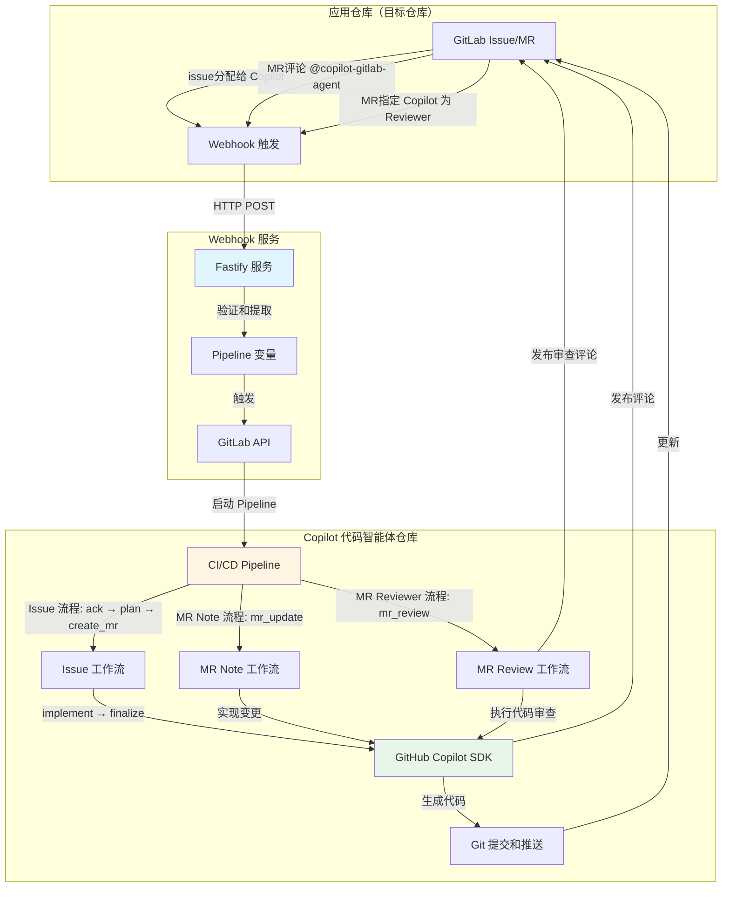

# Copilot Coding Agent for GitLab

[English](../README.md) | 中文 | [日本語](./README_JA.md) | [हिन्दी](./README_HI.md) | [한국어](./README_KO.md) | [ภาษาไทย](./README_TH.md) | [العربية](./README_AR.md)

一个由 GitHub Copilot SDK 和 GitLab CI/CD 驱动的全自动代码智能体。该系统通过 Issue 分配、Merge Request 评论以及 Merge Request Reviewer 指定实现自主代码实现和智能代码审查。

## Demo 演示

**哔哩哔哩视频演示**：  

Setup：  
- [Copilot Coding Agent for GitLab - Setup Guide](https://www.bilibili.com/video/BV1XzywBzEZw/)

使用示例：  
- [Copilot Coding Agent for GitLab - How to use](https://www.bilibili.com/video/BV19BywBgEuh)
  - 02:30 创建 Issue 并交给 Copilot
  - 11:24 让 Copilot 在 MR 里继续改代码

样例仓库：
- 公开 GitLab 演示仓库 [app-repo-01](https://gitlab.com/agentic-devops/app-repo-01)
- Issue: [一个 webhook receiver 应用](https://gitlab.com/agentic-devops/app-repo-01/-/issues/22)
- MR: [一个 webhook receiver 应用 (#22)](https://gitlab.com/agentic-devops/app-repo-01/-/merge_requests/27)
- 使用评论更新 MR: [@copilot-gitlab-agent 将 readme 更改为中文](https://gitlab.com/agentic-devops/app-repo-01/-/merge_requests/27#note_2930310120)
- 代码审查: [将 Copilot 指定为 MR Reviewer](https://gitlab.com/agentic-devops/app-repo-01/-/merge_requests/27#note_2930347195)


## 🏗️ 系统架构



### 系统组件

1. **应用仓库**：你的应用代码仓库，实际开发发生的地方
2. **Webhook 服务**：基于 Fastify 的中继服务，捕获 GitLab 事件
3. **Copilot 代码智能体仓库**：运行编码自动化的 CI/CD 编排器

### 工作流概览

**Issue 分配工作流**（完整自动化）：
```
Issue 分配给 Copilot → Webhook → 触发 Pipeline → 
确认 Issue → 生成 TODO 计划 → 创建 MR → 
实现代码 → 推送变更 → 更新 MR 和 Issue
```

**MR Note 工作流**（快速更新）：
```
在 MR 中评论 @copilot-gitlab-agent → Webhook → 触发 Pipeline →
确认 → 实现变更 → 推送到源分支 →
发布总结评论
```

**MR Reviewer 工作流**（智能代码审查）：
```
指定 Copilot 为 MR Reviewer → Webhook → 触发 Pipeline →
确认 → 分析代码变更 → 执行全面审查 →
发布详细审查评论
```

## 📋 前提条件

### 必需工具
- **GitLab 账号**（具有 API 访问权限）
- **GitLab Runner (Docker/Kubernetes 执行器)**（用于 CI/CD 执行）
- **GitHub Copilot** 订阅（用于 SDK API 访问）
- **Docker**（可选，用于在容器中运行 webhook 服务）

### 必需权限
- **应用仓库**：Maintainer 角色（接收 webhook 和创建 MR）
- **Copilot 代码智能体仓库**：Owner 角色（配置 CI/CD）
- **GitLab 个人访问令牌**，具有以下作用域：
  - `api`（完整 API 访问）
  - `read_repository`
  - `write_repository`

## 🚀 管理员设置指南

### 步骤 1：创建 Copilot 机器人用户（可选但推荐）
> 建议为 Copilot 代码智能体创建一个专用的 GitLab 用户账号，以便更好地管理权限和审计活动。当然你也可以使用现有账号，但不推荐这样做。

1. 创建一个名为 "Copilot" 或类似名称的新 GitLab 账号
2. 为此账号生成个人访问令牌：
   - 前往 **User Settings** → **Personal Access Tokens**
   - 令牌名称：`copilot-automation`
   - 作用域：建议全选（或至少包含：`api`、`read_repository`、`write_repository`）
   - 安全保存令牌
   

3. 为此用户授予适当的权限（选择其中一种方式）：
   - **方案 A（推荐用于组织级使用）**：设置为 GitLab **管理员（Administrator）** 或群组 **Owner**
     - 这样 Copilot 用户可以访问 GitLab 实例或群组下的所有仓库
     - 管理多个项目时更方便
   - **方案 B（推荐用于限定范围）**：将此用户添加为特定应用仓库的成员
     - 角色：**Developer** 或 **Maintainer**
     - 更精细的权限控制，适合需要限制访问范围的场景
   - 此用户将被分配 issue 并创建 merge request

### 步骤 2：设置 Copilot 代码智能体仓库
> 使用 Copilot 用户操作

1. **通过Git URL的方式导入此仓库到你的GitLab中**
  - 使用步骤1中创建的Copilot用户作为仓库所有者，然后导入仓库到GitLab中：  
      ```bash
      https://github.com/trycatchkamal/gitlab-copilot-agent.git
      ```
      
      
      
   - 新导入的仓库的可见性应该为内部可见
      


2. **配置 CI/CD 变量**
   
   前往 **Settings** → **CI/CD** → **Variables**，添加以下变量：

   | 变量名 | 描述 | Protected | Masked |
   |--------|------|-----------|--------|
   | `GITLAB_TOKEN` | 个人访问令牌（来自步骤 1） | ✅ | ✅ |
   | `GITHUB_TOKEN` | GitHub Copilot 访问令牌，包含有效的 GitHub Copilot 订阅和权限 | ✅ | ✅ |

   生成 `GITHUB_TOKEN`，这是一个启用了“Copilot Requests”权限的细粒度个人访问令牌：
   - 访问 https://github.com/settings/personal-access-tokens/new
   - 在“Permissions”下，点击“add permissions”，选择“Copilot Requests”
   - 生成你的令牌
   

  
   

   记住，要把使用pipeline variables的角色修改一下，改为Developer
   

3. **设置 GitLab Runner**
   > 如果你的 GitLab 实例已经有可用的执行器为Docker/Kubernetes的Runner，可以跳过此步骤。
   
   确保你有配置好的 GitLab Runner：
   - Docker 执行器（推荐）
   - 可访问 Docker 镜像：`node:20-alpine`

   如果使用标签，请确保 Runner 有相应标签，或者根据需要更新 `.gitlab-ci.yml`。新 Runner 注册可以根据GitLab页面引导完成，可以在project层级或group层级注册Runner。以project为例：
   

### 步骤 3：部署 Webhook 服务

1. **创建 `.env` 文件**
   ```bash
   cat > .env << EOF
   PIPELINE_TRIGGER_TOKEN=你的触发器令牌，在步骤2创建的仓库中 Settings → CI/CD → Pipeline trigger tokens 中生成
   PIPELINE_PROJECT_ID=你的项目ID，此仓库的项目 ID（在 Settings → General 中找到）
   PIPELINE_REF=main
   GITLAB_API_BASE=https://gitlab.com # 根据需要更改为自托管实例
   WEBHOOK_SECRET_TOKEN=
   COPILOT_AGENT_USERNAME=copilot-gitlab-agent # Copilot 机器人的 GitLab ID
   COPILOT_AGENT_COMMIT_EMAIL=33458317-copilot-gitlab-agent@users.noreply.gitlab.com # git 提交使用的邮箱
   LISTEN_HOST=0.0.0.0
   LISTEN_PORT=8080
   ENABLE_INLINE_REVIEW_COMMENTS=true
   COPILOT_LANGUAGE=zh
   COPILOT_MODEL=gpt-4.1
   EOF
   ```
   - `PIPELINE_TRIGGER_TOKEN`：在步骤 2 中创建的仓库的 **Settings** → **CI/CD** → **Pipeline trigger tokens** 中生成
   
   - `PIPELINE_PROJECT_ID`：此仓库的项目 ID（在 **Settings** → **General** 中找到）
   
   - `COPILOT_AGENT_USERNAME`：步骤 1 中创建的 Copilot 机器人用户的 GitLab ID
   


2. **使用 Docker 运行**
   ```bash
   docker run -itd \
     --name gitlab-copilot-agent \
     -p 8080:8080 \
     --env-file .env \
     --restart unless-stopped \
     trycatchkamal/gitlab-copilot-agent:latest
   ```
3. **源码运行（可选）**
   ```bash
   git clone https://github.com/trycatchkamal/gitlab-copilot-agent.git
   cd gitlab-copilot-agent/
   pnpm start
   ```

4. **Hook地址**
   得到 Webhook 服务的公网地址，例如
   - `http://your-server-ip:8080/gitlab-events`

### 步骤 4：在应用仓库中配置 Webhooks
> 一般开发者如果想要使用 Copilot 代码智能体，只需在自己的应用仓库中配置 Webhook 即可，无需访问 Copilot 代码智能体仓库。

1. 前往你的**应用仓库** → **Settings** → **Webhooks**

2. **创建 Webhook**
   - URL：`http://your-server-ip:8080/gitlab-events`
   - 密钥令牌：（与 `WEBHOOK_SECRET_TOKEN` 相同）
   - 触发器：✅ **Issues events**、✅ **Comments** (note events) 和 ✅ **Merge request events**
   - 点击 **Add webhook**
   

3. **测试 webhook**
   - 点击 **Test** → **Issue events**
   - 检查 webhook 服务日志是否成功接收
   - 验证 HTTP 200/202 响应

### 步骤 5：验证

1. **测试 Issue 分配**
   - 在应用仓库中创建测试 issue
   - 将其分配给 Copilot 用户
   
   - 观察 Copilot 代码智能体仓库中的 CI/CD pipeline 触发
   
   - 验证 MR 创建和代码实现
   
   

2. **测试 MR Note**
   - 在应用仓库中创建测试 MR
   - 评论：`@copilot-gitlab-agent add a hello world function`
   
   - 验证 pipeline 执行和代码变更
   

3. **测试 MR Reviewer**
   - 在应用仓库中创建或打开测试 MR，在 Reviewers 中指定 Copilot 用户
   
   - 验证 pipeline 执行和审查评论发布，并查看 Copilot 发布的详细代码审查报告
   

4. **检查日志**
   ```bash
   # Webhook 服务日志
   docker logs -f gitlab-copilot-agent
   
   # 检查保存的 webhook 有效载荷
   ls -la hooks/
   
   # 检查 pipeline 日志
   # 前往 Copilot 代码智能体仓库 → CI/CD → Pipelines
   ```

## 📖 用户指南

### 开发者：使用 Issue 分配

1. **在应用仓库中创建 Issue**
   ```markdown
   ## 需求
   - 实现用户认证
   - 添加密码哈希
   - 创建登录端点
   - 添加 JWT 令牌生成
   ```

2. **分配给 Copilot**
   - 在 issue 页面，将其分配给 "Copilot" 用户
   - 系统将自动开始工作

3. **跟踪进度**
   - Copilot 发布确认评论，附带 pipeline 链接
   - 创建包含 TODO 清单的 merge request
   - 自动实现代码
   - 最终评论通知完成

   > **注意**：如果该 issue 的 merge request 已经存在，Copilot 会检测到并在 issue 中发布通知，要求您在现有 MR 中继续工作，而不会创建重复的 MR。

4. **审查和合并**
   - 在 MR 中审查生成的代码
   - 如需要可请求更改（见下方 MR Note 用法）
   - 满意后批准并合并

### 开发者：使用 MR Note 命令

1. **在现有 MR 中**，添加评论：
   ```
   @copilot-gitlab-agent 为登录函数添加错误处理
   ```

2. **支持的指令**
   - 添加功能：`@copilot-gitlab-agent 为认证添加单元测试`
   - 修复 bug：`@copilot-gitlab-agent 修复第 45 行的空指针异常`
   - 重构：`@copilot-gitlab-agent 重构用户服务以使用依赖注入`
   - 更新：`@copilot-gitlab-agent 将依赖项更新到最新版本`

3. **Copilot 将会**：
   - 确认你的请求
   - 实现更改
   - 提交并推送到 MR 分支
   - 发布更改摘要

### 开发者：使用 MR Reviewer 进行代码审查

1. **在 MR 页面**，将 Copilot 用户指定为 Reviewer
   - 在 MR 页面右侧找到 "Reviewers" 选项
   - 选择 Copilot 用户（如 copilot-gitlab-agent）

2. **Copilot 将会**：
   - 自动触发代码审查流程
   - 分析源分支和目标分支之间的所有代码变更
   - 执行全面的代码审查，包括：
     - 代码质量和可维护性
     - 最佳实践和设计模式
     - 安全漏洞检查
     - 性能问题分析
     - 测试覆盖率评估
     - 文档完整性检查
   - 在 MR 中发布详细的审查报告，按严重程度分类问题
   - 提供具体的改进建议和推荐修复方案

3. **审查报告内容**：
   - 整体评估摘要
   - 按严重程度分类的问题列表（Critical、Major、Minor、Suggestions）
   - 每个问题包含文件位置、详细描述和修复建议
   - 最终审查建议：APPROVE、REQUEST_CHANGES 或 NEEDS_DISCUSSION

### 最佳实践

**编写有效的 Issue 描述**：
- 明确具体的需求
- 包含验收标准
- 提供上下文和示例
- 使用检查清单处理多个任务

**使用 MR Note 命令**：
- 每条评论一个清晰的指令
- 尽可能引用具体的文件/函数
- 简洁但描述性强
- 在发出下一条指令前等待完成

**代码审查**：
- 始终审查生成的代码
- 测试实现
- 检查安全问题
- 验证编码标准合规性

## 🔧 配置参考

### 中间文件（自动从 Git 排除）

执行过程中生成但从提交中排除的文件：
- `patch_raw.txt` - Copilot 原始输出
- `todo.md` / `todo_completed.md` - 任务清单
- `plan.json` - 执行计划
- `commit_msg.txt` - 生成的提交消息
- `mr_summary.txt` - 变更摘要

## 🐛 故障排除

### Webhook 未触发

1. **检查 webhook 交付**
   - 应用仓库 → Settings → Webhooks → View Recent Deliveries
   - 查找 2xx 状态码

2. **验证 webhook 服务**
   ```bash
   curl -X POST https://gitlab-events.yourdomain.com/gitlab-events \
     -H "Content-Type: application/json" \
     -d '{"test": true}'
   ```

## 📁 项目结构

```
.
├── src/
│   ├── __tests__/                     # 测试文件
│   ├── lib/
│   │   ├── gitlab-api.ts             # GitLab API 客户端 (@gitbeaker/rest)
│   │   ├── prompt-loader.ts          # i18n 提示模板加载器
│   │   ├── git-helpers.ts            # Git 工具函数
│   │   ├── retry.ts                  # 重试工具
│   │   ├── issue-workflow-service.ts # Issue 自动化服务
│   │   ├── mr-update-service.ts      # MR 更新服务
│   │   └── mr-review-service.ts      # MR 代码审查服务
│   ├── config.ts                     # Zod 验证的配置
│   ├── types.ts                      # TypeScript 类型和 Zod schemas
│   ├── extractors.ts                 # 变量提取逻辑
│   ├── pipeline.ts                   # Pipeline 触发客户端
│   ├── utils.ts                      # 工具函数
│   ├── gitlab-events-handler.ts      # 主 webhook 处理器
│   ├── index.ts                      # 应用程序入口 (Fastify)
│   ├── issue-workflow-cli.ts         # Issue 工作流 CLI (用于 CI/CD)
│   ├── mr-update-cli.ts              # MR 更新 CLI (用于 CI/CD)
│   └── mr-review-cli.ts              # MR 审查 CLI (用于 CI/CD)
├── prompts/                          # i18n 提示模板 (en, ar, hi, ja, ko, th, zh)
├── hooks/                            # 保存的 webhook 有效载荷
├── logs/                             # 应用程序日志
└── dist/                             # 编译后的 JavaScript
```

## 🛠️ 技术栈

- **运行时**: Node.js 20+
- **框架**: Fastify 5
- **语言**: TypeScript (严格模式)
- **AI SDK**: @github/copilot-sdk
- **验证**: Zod
- **测试**: Jest + ts-jest
- **HTTP 客户端**: Undici (原生 Node.js fetch)
- **Git 操作**: simple-git
- **GitLab API**: @gitbeaker/rest
- **日志**: Pino
- **国际化**: 7 种语言 (en, zh, ja, hi, ko, th, ar)
