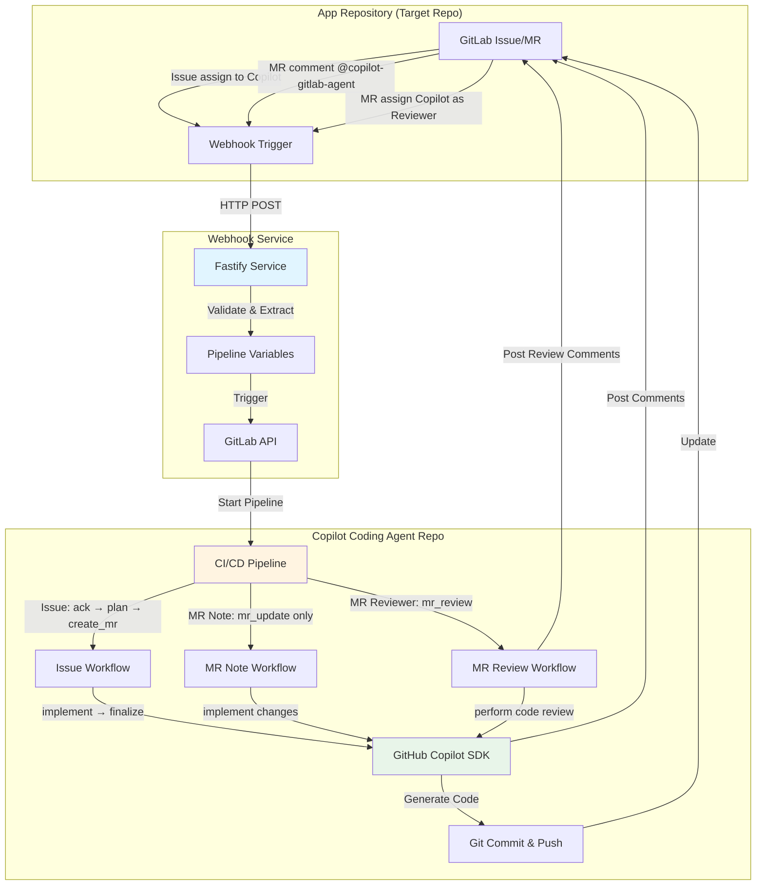

# GitLab के लिए Copilot कोडिंग एजेंट

[English](../README.md) | [中文](./README_CN.md) | [日本語](./README_JA.md) | हिन्दी | [한국어](./README_KO.md) | [ภาษาไทย](./README_TH.md) | [العربية](./README_AR.md)

GitHub Copilot SDK और GitLab CI/CD द्वारा संचालित एक पूर्ण स्वचालित कोडिंग एजेंट। यह सिस्टम issue assignments, merge request comments, और merge request reviewer assignments के माध्यम से स्वायत्त कोड कार्यान्वयन और बुद्धिमान कोड समीक्षा को सक्षम बनाता है।

## डेमो और उदाहरण
**Youtube डेमो वीडियो**

सेटअप:
- [Copilot Coding Agent for GitLab - Setup Guide](https://www.youtube.com/watch?v=aSQVP1AAD60)

उपयोग कैसे करें:
- [Copilot Coding Agent for GitLab - How to use 2:30 – Create an issue in the app repo and assign it to Copilot](https://www.youtube.com/watch?v=med7Bfff_m4&t=150s)
- [Copilot Coding Agent for GitLab - How to use 11:24 – Let Copilot make some updates in the merge request via comments](https://www.youtube.com/watch?v=med7Bfff_m4&t=684s)

**उदाहरण रिपॉजिटरी**
- सार्वजनिक GitLab डेमो रिपॉजिटरी [app-repo-01](https://gitlab.com/agentic-devops/app-repo-01)
- Issue: [एक Webhook रिसीवर एप्लिकेशन](https://gitlab.com/agentic-devops/app-repo-01/-/issues/18)
- MR: [एक Webhook रिसीवर एप्लिकेशन (#18)](https://gitlab.com/agentic-devops/app-repo-01/-/merge_requests/23)
- Comment के साथ MR अपडेट करें: [@copilot-gitlab-agent readme को हिंदी में बदलें](https://gitlab.com/agentic-devops/app-repo-01/-/merge_requests/23#note_2929895227)
- कोड समीक्षा: [MR में Copilot को समीक्षा करने वाले के रूप में असाइन करें](https://gitlab.com/agentic-devops/app-repo-01/-/merge_requests/23#note_2929964796)

## 🏗️ आर्किटेक्चर



### सिस्टम घटक

1. **एप्लिकेशन रिपॉजिटरी**: आपका एप्लिकेशन कोड रिपॉजिटरी जहाँ विकास होता है
2. **Webhook सेवा**: Fastify-आधारित रिले सेवा जो GitLab इवेंट्स को कैप्चर करती है
3. **Copilot कोडिंग एजेंट रिपॉजिटरी**: CI/CD ऑर्केस्ट्रेटर जो कोडिंग स्वचालन चलाता है

### वर्कफ़्लो अवलोकन

**Issue असाइनमेंट वर्कफ़्लो** (पूर्ण स्वचालन):
```
Issue को Copilot को असाइन किया → Webhook → Pipeline ट्रिगर →
Issue स्वीकार करें → TODO योजना बनाएं → MR बनाएं →
कोड लागू करें → परिवर्तन Push करें → MR और Issue अपडेट करें
```

**MR Note वर्कफ़्लो** (त्वरित अपडेट):
```
MR में @copilot-gitlab-agent को Comment करें → Webhook → Pipeline ट्रिगर →
स्वीकार करें → परिवर्तन लागू करें → Source Branch में Push करें →
सारांश Comment पोस्ट करें
```

**MR Reviewer वर्कफ़्लो** (बुद्धिमान कोड समीक्षा):
```
Copilot को MR Reviewer के रूप में असाइन करें → Webhook → Pipeline ट्रिगर →
स्वीकार करें → कोड परिवर्तनों का विश्लेषण करें → व्यापक समीक्षा करें →
विस्तृत समीक्षा Comment पोस्ट करें
```

## 📋 पूर्वापेक्षाएं

### आवश्यक उपकरण
- API एक्सेस के साथ **GitLab अकाउंट**
- **GitLab Runner (Docker/Kubernetes executor)** (CI/CD निष्पादन के लिए)
- **GitHub Copilot** सब्सक्रिप्शन (SDK API एक्सेस के लिए)
- **Docker** (वैकल्पिक, webhook सेवा को कंटेनर में चलाने के लिए)

### आवश्यक अनुमतियाँ
- **एप्लिकेशन रिपॉजिटरी**: Maintainer भूमिका (webhooks प्राप्त करने और MR बनाने के लिए)
- **Copilot कोडिंग एजेंट रिपॉजिटरी**: Owner भूमिका (CI/CD कॉन्फ़िगर करने के लिए)
- **GitLab Personal Access Token** निम्नलिखित स्कोप के साथ:
  - `api` (पूर्ण API एक्सेस)
  - `read_repository`
  - `write_repository`

## 🚀 प्रशासक सेटअप गाइड

### चरण 1: Copilot बॉट उपयोगकर्ता बनाएं (वैकल्पिक लेकिन अनुशंसित)
> बेहतर अनुमति प्रबंधन और गतिविधि ऑडिटिंग के लिए Copilot एजेंट के लिए एक समर्पित GitLab उपयोगकर्ता अकाउंट बनाने का सुझाव दिया गया है। आप एक मौजूदा अकाउंट का उपयोग कर सकते हैं, लेकिन यह अनुशंसित नहीं है।

1. "Copilot" या इसी तरह के नाम से एक नया GitLab अकाउंट बनाएं
2. इस अकाउंट के लिए एक Personal Access Token उत्पन्न करें:
   - **User Settings** → **Personal Access Tokens** पर जाएं
   - Token नाम: `copilot-automation`
   - स्कोप: सभी स्कोप का चयन करें (या न्यूनतम: `api`, `read_repository`, `write_repository`)
   - टोकन को सुरक्षित रूप से सहेजें
   

3. इस उपयोगकर्ता को उचित अनुमतियाँ प्रदान करें (एक दृष्टिकोण चुनें):
   - **विकल्प A (संगठन-व्यापी उपयोग के लिए अनुशंसित)**: GitLab **Administrator** या Group **Owner** के रूप में सेट करें
     - यह Copilot उपयोगकर्ता को GitLab इंस्टेंस या ग्रुप में सभी रिपॉजिटरी तक पहुँचने की अनुमति देता है
     - कई परियोजनाओं को प्रबंधित करने के लिए अधिक सुविधाजनक
   - **विकल्प B (सीमित स्कोप के लिए अनुशंसित)**: विशिष्ट एप्लिकेशन रिपॉजिटरी में सदस्य के रूप में जोड़ें
     - भूमिका: **Developer** या **Maintainer**
     - अधिक विस्तृत नियंत्रण, यदि आप प्रतिबंधित एक्सेस पसंद करते हैं तो उपयुक्त
   - यह उपयोगकर्ता issues को असाइन किया जाएगा और merge requests बनाएगा

### चरण 2: Copilot कोडिंग एजेंट रिपॉजिटरी सेटअप करें
> Copilot उपयोगकर्ता संचालन का उपयोग करते हुए

1. **इस रिपॉजिटरी को Git URL के माध्यम से अपने GitLab में आयात करें**
   - चरण 1 में बनाए गए Copilot उपयोगकर्ता को रिपॉजिटरी के owner के रूप में उपयोग करें, फिर GitLab में रिपॉजिटरी आयात करें:
     ```bash
     https://github.com/trycatchkamal/gitlab-copilot-agent.git
     ```
      
      
      
   - नई आयातित रिपॉजिटरी की दृश्यता Internal पर सेट की जानी चाहिए
      

2. **CI/CD वेरिएबल कॉन्फ़िगर करें**

   **Settings** → **CI/CD** → **Variables** पर जाएं, निम्नलिखित जोड़ें:

   | वेरिएबल | विवरण | Protected | Masked |
   |----------|-------------|-----------|--------|
   | `GITLAB_TOKEN` | Personal access token (चरण 1 से) | ✅ | ✅ |
   | `GITHUB_TOKEN` | GitHub Copilot SDK एक्सेस टोकन, एक वैध GitHub Copilot सब्सक्रिप्शन सहित | ✅ | ✅ |

   "Copilot Requests" अनुमति सक्षम के साथ fine-grained PAT `GITHUB_TOKEN` उत्पन्न करने के लिए:
   - https://github.com/settings/personal-access-tokens/new पर जाएं
   - "Permissions" के अंतर्गत, "add permissions" पर क्लिक करें और "Copilot Requests" चुनें
   - अपना टोकन उत्पन्न करें
   


   

   याद रखें कि pipeline variables का उपयोग करने वाली भूमिका को Developer में बदलें
   

3. **GitLab Runner सेटअप करें**
   > यदि आपके GitLab इंस्टेंस में पहले से Docker/Kubernetes executors के साथ उपलब्ध Runners हैं, तो आप इस चरण को छोड़ सकते हैं।

   सुनिश्चित करें कि आपके पास निम्नलिखित के साथ कॉन्फ़िगर किया गया GitLab Runner है:
   - Docker executor (अनुशंसित)
   - Docker image तक पहुँच: `node:20-alpine`

   यदि टैग का उपयोग कर रहे हैं, तो सुनिश्चित करें कि Runner में संबंधित टैग हैं, या आवश्यकतानुसार `.gitlab-ci.yml` को अपडेट करें। नया Runner पंजीकरण GitLab के पेज मार्गदर्शन का पालन करके पूरा किया जा सकता है, और प्रोजेक्ट या ग्रुप स्तर पर पंजीकृत किया जा सकता है। यहाँ प्रोजेक्ट स्तर के लिए एक उदाहरण है:
   

### चरण 3: Webhook सेवा को Deploy करें

1. **`.env` फ़ाइल बनाएं**
   ```bash
   cat > .env << EOF
   PIPELINE_TRIGGER_TOKEN=your-trigger-token, चरण 2 में बनाई गई रिपॉजिटरी के Settings → CI/CD → Pipeline trigger tokens में उत्पन्न करें
   PIPELINE_PROJECT_ID=your-project-id, इस रिपॉजिटरी का प्रोजेक्ट ID (Settings → General में मिलता है)
   PIPELINE_REF=main
   GITLAB_API_BASE=https://gitlab.com # यदि आवश्यक हो तो self-hosted instance में बदलें
   WEBHOOK_SECRET_TOKEN=
   COPILOT_AGENT_USERNAME=copilot-gitlab-agent # Copilot बॉट का GitLab ID
   COPILOT_AGENT_COMMIT_EMAIL=33458317-copilot-gitlab-agent@users.noreply.gitlab.com # git commits के लिए ईमेल
   LISTEN_HOST=0.0.0.0
   LISTEN_PORT=8080
   ENABLE_INLINE_REVIEW_COMMENTS=true
   COPILOT_LANGUAGE=hi
   COPILOT_MODEL=gpt-4.1
   EOF
   ```

   - `PIPELINE_TRIGGER_TOKEN`: चरण 2 में बनाई गई रिपॉजिटरी के **Settings** → **CI/CD** → **Pipeline trigger tokens** में उत्पन्न किया गया
   
   - `PIPELINE_PROJECT_ID`: इस रिपॉजिटरी का प्रोजेक्ट ID (**Settings** → **General** में मिलता है)
   
   - `COPILOT_AGENT_USERNAME`: चरण 1 में बनाए गए Copilot बॉट उपयोगकर्ता का GitLab ID
   

2. **Docker के साथ चलाएं**
   ```bash
   docker run -itd \
     --name gitlab-copilot-agent \
     -p 8080:8080 \
     --env-file .env \
     --restart unless-stopped \
     trycatchkamal/gitlab-copilot-agent:latest
   ```
3. **स्रोत से चलाएं (वैकल्पिक)**
   ```bash
   git clone https://github.com/trycatchkamal/gitlab-copilot-agent.git
   cd gitlab-copilot-agent/
   pnpm start
   ```
4. **Hook URL**
   webhook सेवा का सार्वजनिक URL प्राप्त करें, उदाहरण के लिए,
   - `http://your-server-ip:8080/gitlab-events`

### चरण 4: एप्लिकेशन रिपॉजिटरी में Webhooks कॉन्फ़िगर करें
> आमतौर पर, जो डेवलपर्स Copilot कोडिंग एजेंट का उपयोग करना चाहते हैं, उन्हें केवल अपनी खुद की एप्लिकेशन रिपॉजिटरी में webhook को कॉन्फ़िगर करने की आवश्यकता होती है, Copilot कोडिंग एजेंट रिपॉजिटरी तक पहुँचने की नहीं।

1. अपने **एप्लिकेशन रिपॉजिटरी** → **Settings** → **Webhooks** पर जाएं

2. **Webhook बनाएं**
   - URL: `http://your-server-ip:8080/gitlab-events`
   - Secret Token: (`WEBHOOK_SECRET_TOKEN` के समान)
   - Trigger: ✅ **Issues events**, ✅ **Comments** (note events), और ✅ **Merge request events**
   - **Add webhook** पर क्लिक करें
   

3. **webhook का परीक्षण करें**
   - **Test** → **Issue events** पर क्लिक करें
   - webhook सेवा लॉग में सफल रिसेप्शन की जाँच करें
   - HTTP 200/202 रिस्पॉन्स सत्यापित करें

### चरण 5: सत्यापन

1. **Issue असाइनमेंट का परीक्षण करें**
   - एप्लिकेशन रिपॉजिटरी में एक परीक्षण issue बनाएं
   - इसे Copilot उपयोगकर्ता को असाइन करें
   
   - Copilot कोडिंग एजेंट रिपॉ में CI/CD pipeline ट्रिगर देखें
   
   - MR निर्माण और कोड कार्यान्वयन सत्यापित करें
   
   

2. **MR Note का परीक्षण करें**
   - एप्लिकेशन रिपॉजिटरी में एक परीक्षण MR बनाएं
   - Comment: `@copilot-gitlab-agent add a hello world function`
   
   - pipeline निष्पादन और कोड परिवर्तन सत्यापित करें
   

3. **MR Reviewer का परीक्षण करें**
   - एप्लिकेशन रिपॉजिटरी में एक परीक्षण MR बनाएं या खोलें, Copilot उपयोगकर्ता को Reviewer के रूप में असाइन करें
   
   - pipeline निष्पादन और समीक्षा comment पोस्टिंग सत्यापित करें, Copilot द्वारा पोस्ट की गई विस्तृत कोड समीक्षा रिपोर्ट की जाँच करें
   

4. **लॉग की जाँच करें**
   ```bash
   # Webhook सेवा लॉग
   docker logs -f gitlab-copilot-agent

   # सहेजे गए webhook payloads की जाँच करें
   ls -la hooks/

   # Pipeline लॉग की जाँच करें
   # Copilot कोडिंग एजेंट रिपॉ → CI/CD → Pipelines पर जाएं
   ```

## 📖 उपयोगकर्ता गाइड

### डेवलपर्स के लिए: Issue असाइनमेंट का उपयोग

1. **अपनी एप्लिकेशन रिपॉजिटरी में एक Issue बनाएं**
   ```markdown
   ## आवश्यकताएं
   - उपयोगकर्ता प्रमाणीकरण लागू करें
   - पासवर्ड हैशिंग जोड़ें
   - लॉगिन endpoint बनाएं
   - JWT टोकन जनरेशन जोड़ें
   ```

2. **Copilot को असाइन करें**
   - issue पेज में, इसे "Copilot" उपयोगकर्ता को असाइन करें
   - सिस्टम स्वचालित रूप से काम करना शुरू कर देगा

3. **प्रगति ट्रैक करें**
   - Copilot pipeline लिंक के साथ एक acknowledgment comment पोस्ट करता है
   - TODO checklist के साथ एक merge request बनाया जाता है
   - कोड स्वचालित रूप से लागू किया जाता है
   - अंतिम comment पूर्णता की सूचना देता है

   > **नोट**: यदि issue के लिए एक merge request पहले से मौजूद है, तो Copilot इसे पहचान लेगा और issue में एक सूचना पोस्ट करेगा, आपको डुप्लिकेट बनाने के बजाय मौजूदा MR में काम जारी रखने के लिए कहेगा।

4. **समीक्षा और Merge करें**
   - MR में उत्पन्न कोड की समीक्षा करें
   - यदि आवश्यक हो तो परिवर्तन का अनुरोध करें (नीचे MR Note उपयोग देखें)
   - संतुष्ट होने पर स्वीकृत करें और merge करें

### डेवलपर्स के लिए: MR Note कमांड का उपयोग

1. **एक मौजूदा MR में**, एक comment जोड़ें:
   ```
   @copilot-gitlab-agent add error handling to the login function
   ```

2. **समर्थित निर्देश**
   - सुविधाएँ जोड़ें: `@copilot-gitlab-agent add unit tests for authentication`
   - बग्स ठीक करें: `@copilot-gitlab-agent fix the null pointer exception in line 45`
   - रिफैक्टर करें: `@copilot-gitlab-agent refactor the user service to use dependency injection`
   - अपडेट करें: `@copilot-gitlab-agent update dependencies to latest versions`

3. **Copilot निम्नलिखित करेगा**:
   - आपके अनुरोध को स्वीकार करें
   - परिवर्तनों को लागू करें
   - MR ब्रांच में commit और push करें
   - परिवर्तनों का सारांश पोस्ट करें

### डेवलपर्स के लिए: कोड समीक्षा के लिए MR Reviewer का उपयोग

1. **MR पेज पर**, Copilot उपयोगकर्ता को Reviewer के रूप में असाइन करें
   - MR पेज के दाईं ओर "Reviewers" विकल्प खोजें
   - Copilot उपयोगकर्ता चुनें (उदाहरण के लिए, copilot-gitlab-agent)

2. **Copilot निम्नलिखित करेगा**:
   - स्वचालित रूप से कोड समीक्षा वर्कफ़्लो ट्रिगर करें
   - source और target branches के बीच सभी कोड परिवर्तनों का विश्लेषण करें
   - व्यापक कोड समीक्षा करें जिसमें शामिल है:
     - कोड गुणवत्ता और रखरखाव
     - सर्वोत्तम प्रथाएं और डिज़ाइन पैटर्न
     - सुरक्षा भेद्यता जाँच
     - प्रदर्शन विश्लेषण
     - परीक्षण कवरेज मूल्यांकन
     - दस्तावेज़ीकरण पूर्णता
   - MR में विस्तृत समीक्षा रिपोर्ट पोस्ट करें, गंभीरता द्वारा वर्गीकृत
   - विशिष्ट सुधार सुझाव और अनुशंसित फिक्स प्रदान करें

3. **समीक्षा रिपोर्ट की सामग्री**:
   - समग्र मूल्यांकन सारांश
   - गंभीरता द्वारा वर्गीकृत समस्याएं (Critical, Major, Minor, Suggestions)
   - प्रत्येक समस्या में फ़ाइल स्थान, विस्तृत विवरण, और फिक्स सिफारिशें शामिल हैं
   - अंतिम समीक्षा सिफारिश: APPROVE, REQUEST_CHANGES, या NEEDS_DISCUSSION

### सर्वोत्तम प्रथाएं

**प्रभावी Issue विवरण लिखना**:
- आवश्यकताओं के बारे में विशिष्ट रहें
- स्वीकृति मानदंड शामिल करें
- संदर्भ और उदाहरण प्रदान करें
- कई कार्यों के लिए चेकलिस्ट का उपयोग करें

**MR Note कमांड का उपयोग**:
- प्रति comment एक स्पष्ट निर्देश
- जब भी संभव हो विशिष्ट फ़ाइलों/functions का संदर्भ दें
- संक्षिप्त लेकिन वर्णनात्मक रहें
- अगले निर्देश से पहले पूर्णता की प्रतीक्षा करें

**कोड समीक्षा**:
- हमेशा उत्पन्न कोड की समीक्षा करें
- कार्यान्वयन का परीक्षण करें
- सुरक्षा समस्याओं की जाँच करें
- कोडिंग मानक अनुपालन सत्यापित करें

## 🔧 कॉन्फ़िगरेशन संदर्भ

### मध्यवर्ती फ़ाइलें (Git से स्वतः-बहिष्कृत)

निम्नलिखित फ़ाइलें निष्पादन के दौरान उत्पन्न होती हैं लेकिन commits से बाहर रखी जाती हैं:
- `patch_raw.txt` - कच्चा Copilot आउटपुट
- `todo.md` / `todo_completed.md` - कार्य चेकलिस्ट
- `plan.json` - निष्पादन योजना
- `commit_msg.txt` - उत्पन्न commit संदेश
- `mr_summary.txt` - परिवर्तन सारांश

## 🐛 समस्या निवारण

### Webhook ट्रिगर नहीं हो रहा है

1. **webhook डिलीवरी की जाँच करें**
   - एप्लिकेशन रिपॉ → Settings → Webhooks → View Recent Deliveries
   - 2xx status codes देखें

2. **webhook सेवा सत्यापित करें**
   ```bash
   curl -X POST https://gitlab-events.yourdomain.com/gitlab-events \
     -H "Content-Type: application/json" \
     -d '{"test": true}'
   ```

## 📁 प्रोजेक्ट संरचना

```
.
├── src/
│   ├── __tests__/                     # टेस्ट फ़ाइलें
│   ├── lib/
│   │   ├── gitlab-api.ts             # GitLab API क्लाइंट (@gitbeaker/rest)
│   │   ├── prompt-loader.ts          # i18n प्रॉम्प्ट टेम्पलेट लोडर
│   │   ├── git-helpers.ts            # Git यूटिलिटी फ़ंक्शन
│   │   ├── retry.ts                  # रीट्राई यूटिलिटी
│   │   ├── issue-workflow-service.ts # Issue ऑटोमेशन सर्विस
│   │   ├── mr-update-service.ts      # MR अपडेट सर्विस
│   │   └── mr-review-service.ts      # MR कोड रिव्यू सर्विस
│   ├── config.ts                     # Zod वैलिडेशन के साथ कॉन्फ़िगरेशन
│   ├── types.ts                      # TypeScript टाइप्स और Zod स्कीमा
│   ├── extractors.ts                 # वेरिएबल एक्सट्रैक्शन लॉजिक
│   ├── pipeline.ts                   # Pipeline ट्रिगर क्लाइंट
│   ├── utils.ts                      # यूटिलिटी फ़ंक्शन
│   ├── gitlab-events-handler.ts      # मुख्य webhook हैंडलर
│   ├── index.ts                      # एप्लिकेशन एंट्री पॉइंट (Fastify)
│   ├── issue-workflow-cli.ts         # Issue वर्कफ़्लो CLI (CI/CD के लिए)
│   ├── mr-update-cli.ts              # MR अपडेट CLI (CI/CD के लिए)
│   └── mr-review-cli.ts              # MR रिव्यू CLI (CI/CD के लिए)
├── prompts/                          # i18n प्रॉम्प्ट टेम्पलेट (en, ar, hi, ja, ko, th, zh)
├── hooks/                            # सेव किए गए webhook पेलोड
├── logs/                             # एप्लिकेशन लॉग
└── dist/                             # कंपाइल्ड JavaScript
```

## 🛠️ टेक स्टैक

- **रनटाइम**: Node.js 20+
- **फ्रेमवर्क**: Fastify 5
- **भाषा**: TypeScript (strict मोड)
- **AI SDK**: @github/copilot-sdk
- **वैलिडेशन**: Zod
- **टेस्टिंग**: Jest + ts-jest
- **HTTP क्लाइंट**: Undici (नेटिव Node.js fetch)
- **Git ऑपरेशन**: simple-git
- **GitLab API**: @gitbeaker/rest
- **लॉगिंग**: Pino
- **i18n**: 7 भाषाएं (en, zh, ja, hi, ko, th, ar)
