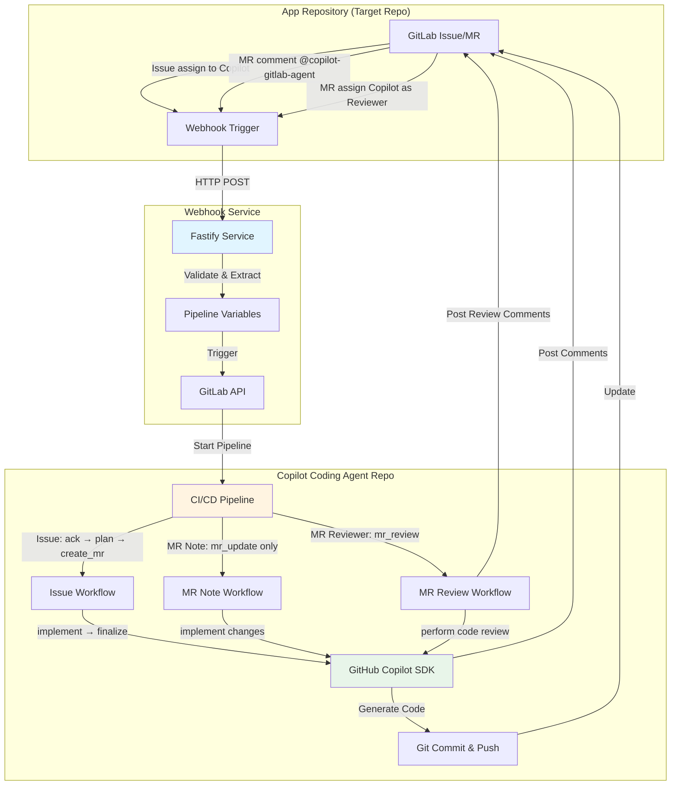

# GitLab 用 Copilot コーディングエージェント

[English](../README.md) | [中文](./README_CN.md) | 日本語 | [हिन्दी](./README_HI.md) | [한국어](./README_KO.md) | [ภาษาไทย](./README_TH.md) | [العربية](./README_AR.md)

GitHub Copilot SDK と GitLab CI/CD を活用した完全自動コーディングエージェント。Issue 割り当て、マージリクエストコメント、マージリクエストレビュアー割り当てを通じて、自律的なコード実装とインテリジェントなコードレビューを実現します。

## デモ & 例
**Youtube デモ動画**

セットアップ:
- [Copilot Coding Agent for GitLab - Setup Guide](https://www.youtube.com/watch?v=aSQVP1AAD60)

使用方法:
- [Copilot Coding Agent for GitLab - How to use 2:30 – Create an issue in the app repo and assign it to Copilot](https://www.youtube.com/watch?v=med7Bfff_m4&t=150s)
- [Copilot Coding Agent for GitLab - How to use 11:24 – Let Copilot make some updates in the merge request via comments](https://www.youtube.com/watch?v=med7Bfff_m4&t=684s)

**サンプルリポジトリ**
- パブリック GitLab デモリポジトリ [app-repo-01](https://gitlab.com/agentic-devops/app-repo-01)
- Issue: [webhook receiverアプリケーション](https://gitlab.com/agentic-devops/app-repo-01/-/issues/17)
- MR: [Cwebhook receiverアプリケーション (#17)](https://gitlab.com/agentic-devops/app-repo-01/-/merge_requests/22)
- コメントで MR を更新: [@copilot-gitlab-agent readmeを日本語に変更](https://gitlab.com/agentic-devops/app-repo-01/-/merge_requests/22#note_2929811253)
- コードレビュー: [MRにCopilotを指定するレビュー担当者](https://gitlab.com/agentic-devops/app-repo-01/-/merge_requests/22#note_2929831527)

## 🏗️ アーキテクチャ



### システムコンポーネント

1. **アプリケーションリポジトリ**: 開発が行われるアプリケーションコードリポジトリ
2. **Webhook サービス**: GitLab イベントをキャプチャする Fastify ベースのリレーサービス
3. **Copilot コーディングエージェントリポジトリ**: コーディング自動化を実行する CI/CD オーケストレータ

### ワークフロー概要

**Issue 割り当てワークフロー**（完全自動化）:
```
Issue を Copilot に割り当て → Webhook → パイプライントリガー →
Issue 確認 → TODO プラン生成 → MR 作成 →
コード実装 → 変更をプッシュ → MR & Issue を更新
```

**MR Note ワークフロー**（迅速な更新）:
```
MR で @copilot-gitlab-agent にコメント → Webhook → パイプライントリガー →
確認 → 変更を実装 → ソースブランチにプッシュ →
サマリーコメント投稿
```

**MR Reviewer ワークフロー**（インテリジェントなコードレビュー）:
```
Copilot を MR レビュアーに割り当て → Webhook → パイプライントリガー →
確認 → コード変更を分析 → 包括的なレビューを実行 →
詳細なレビューコメント投稿
```

## 📋 前提条件

### 必要なツール
- API アクセス権限を持つ **GitLab アカウント**
- **GitLab Runner（Docker/Kubernetes executor）**（CI/CD 実行用）
- **GitHub Copilot** サブスクリプション（SDK API アクセス用）
- **Docker**（オプション、webhook サービスをコンテナで実行する場合）

### 必要な権限
- **アプリケーションリポジトリ**: メンテナー権限（webhook 受信と MR 作成用）
- **Copilot コーディングエージェントリポジトリ**: オーナー権限（CI/CD 設定用）
- **GitLab パーソナルアクセストークン** スコープ:
  - `api`（フル API アクセス）
  - `read_repository`
  - `write_repository`

## 🚀 管理者セットアップガイド

### ステップ 1: Copilot ボットユーザーの作成（推奨）
> 権限管理とアクティビティ監査を改善するため、Copilot エージェント用に専用の GitLab ユーザーアカウントを作成することを推奨します。既存のアカウントも使用できますが、推奨されません。

1. 「Copilot」または類似の名前で新しい GitLab アカウントを作成
2. このアカウントのパーソナルアクセストークンを生成:
   - **ユーザー設定** → **パーソナルアクセストークン** に移動
   - トークン名: `copilot-automation`
   - スコープ: すべてのスコープを選択（または最低限: `api`, `read_repository`, `write_repository`）
   - トークンを安全に保存
   

3. このユーザーに適切な権限を付与（どちらかのアプローチを選択）:
   - **オプション A（組織全体での使用を推奨）**: GitLab **管理者**またはグループ **オーナー**として設定
     - これにより、Copilot ユーザーは GitLab インスタンスまたはグループ内のすべてのリポジトリにアクセス可能
     - 複数のプロジェクトを管理する際に便利
   - **オプション B（限定的なスコープを推奨）**: 特定のアプリケーションリポジトリにメンバーとして追加
     - 役割: **Developer** または **Maintainer**
     - より詳細な制御、アクセスを制限したい場合に適しています
   - このユーザーは Issue に割り当てられ、マージリクエストを作成します

### ステップ 2: Copilot コーディングエージェントリポジトリのセットアップ
> Copilot ユーザー操作を使用

1. **このリポジトリを Git URL 経由で GitLab にインポート**
   - ステップ 1 で作成した Copilot ユーザーをリポジトリのオーナーとして使用し、GitLab にリポジトリをインポートします:
     ```bash
     https://github.com/trycatchkamal/gitlab-copilot-agent.git
     ```
      
      
      
   - 新しくインポートされたリポジトリの可視性は Internal に設定してください
      

2. **CI/CD 変数を設定**

   **Settings** → **CI/CD** → **Variables** に移動し、以下を追加:

   | 変数 | 説明 | Protected | Masked |
   |----------|-------------|-----------|--------|
   | `GITLAB_TOKEN` | パーソナルアクセストークン（ステップ 1 から） | ✅ | ✅ |
   | `GITHUB_TOKEN` | 有効な GitHub Copilot サブスクリプションを含む GitHub Copilot アクセストークン | ✅ | ✅ |

   「Copilot Requests」権限が有効な fine-grained PAT である `GITHUB_TOKEN` を生成するには:
   - https://github.com/settings/personal-access-tokens/new にアクセス
   - 「Permissions」の下で「add permissions」をクリックし、「Copilot Requests」を選択
   - トークンを生成
   


   

   パイプライン変数を使用できる役割を Developer に変更することを忘れないでください
   

3. **GitLab Runner のセットアップ**
   > GitLab インスタンスに Docker/Kubernetes executor を持つ利用可能な Runner がすでにある場合は、このステップをスキップできます。

   以下の条件で GitLab Runner が設定されていることを確認してください:
   - Docker executor（推奨）
   - Docker イメージへのアクセス: `node:20-alpine`

   タグを使用する場合は、Runner に対応するタグがあることを確認するか、必要に応じて `.gitlab-ci.yml` を更新してください。新しい Runner の登録は GitLab のページガイダンスに従って完了でき、プロジェクトまたはグループレベルで登録できます。以下はプロジェクトレベルの例です:
   

### ステップ 3: Webhook サービスのデプロイ

1. **`.env` ファイルを作成**
   ```bash
   cat > .env << EOF
   PIPELINE_TRIGGER_TOKEN=your-trigger-token, ステップ 2 で作成したリポジトリの Settings → CI/CD → Pipeline trigger tokens で生成
   PIPELINE_PROJECT_ID=your-project-id, このリポジトリのプロジェクト ID（Settings → General で確認）
   PIPELINE_REF=main
   GITLAB_API_BASE=https://gitlab.com # セルフホストインスタンスの場合は変更が必要
   WEBHOOK_SECRET_TOKEN=
   COPILOT_AGENT_USERNAME=copilot-gitlab-agent # Copilot ボットの GitLab ID
   COPILOT_AGENT_COMMIT_EMAIL=33458317-copilot-gitlab-agent@users.noreply.gitlab.com # git コミット用のメールアドレス
   LISTEN_HOST=0.0.0.0
   LISTEN_PORT=8080
   ENABLE_INLINE_REVIEW_COMMENTS=true
   COPILOT_LANGUAGE=ja
   COPILOT_MODEL=gpt-4.1
   EOF
   ```

   - `PIPELINE_TRIGGER_TOKEN`: ステップ 2 で作成したリポジトリの **Settings** → **CI/CD** → **Pipeline trigger tokens** で生成
   
   - `PIPELINE_PROJECT_ID`: このリポジトリのプロジェクト ID（**Settings** → **General** で確認）
   
   - `COPILOT_AGENT_USERNAME`: ステップ 1 で作成した Copilot ボットユーザーの GitLab ID
   

2. **Docker で実行**
   ```bash
   docker run -itd \
     --name gitlab-copilot-agent \
     -p 8080:8080 \
     --env-file .env \
     --restart unless-stopped \
     trycatchkamal/gitlab-copilot-agent:latest
   ```
3. **ソースから実行（オプション）**
   ```bash
   git clone https://github.com/trycatchkamal/gitlab-copilot-agent.git
   cd gitlab-copilot-agent/
   pnpm start
   ```
4. **Hook URL**
   webhook サービスの公開 URL を取得します。例:
   - `http://your-server-ip:8080/gitlab-events`

### ステップ 4: アプリケーションリポジトリで Webhook を設定
> 一般的に、Copilot コーディングエージェントを使用したい開発者は、Copilot コーディングエージェントリポジトリにアクセスすることなく、自分のアプリケーションリポジトリで webhook を設定するだけで済みます。

1. **アプリケーションリポジトリ** → **Settings** → **Webhooks** に移動

2. **Webhook を作成**
   - URL: `http://your-server-ip:8080/gitlab-events`
   - Secret Token: （`WEBHOOK_SECRET_TOKEN` と同じ）
   - Trigger: ✅ **Issues events**, ✅ **Comments**（note events）, ✅ **Merge request events**
   - **Add webhook** をクリック
   

3. **webhook をテスト**
   - **Test** → **Issue events** をクリック
   - webhook サービスログで受信成功を確認
   - HTTP 200/202 レスポンスを確認

### ステップ 5: 検証

1. **Issue 割り当てをテスト**
   - アプリケーションリポジトリでテスト Issue を作成
   - Copilot ユーザーに割り当て
   
   - Copilot コーディングエージェントリポジトリで CI/CD パイプラインのトリガーを確認
   
   - MR 作成とコード実装を確認
   
   

2. **MR Note をテスト**
   - アプリケーションリポジトリでテスト MR を作成
   - コメント: `@copilot-gitlab-agent add a hello world function`
   
   - パイプライン実行とコード変更を確認
   

3. **MR Reviewer をテスト**
   - アプリケーションリポジトリでテスト MR を作成または開く、Copilot ユーザーをレビュアーに割り当て
   
   - パイプライン実行とレビューコメントの投稿を確認、Copilot が投稿した詳細なコードレビューレポートを確認
   

4. **ログを確認**
   ```bash
   # Webhook サービスログ
   docker logs -f gitlab-copilot-agent

   # 保存された webhook ペイロードを確認
   ls -la hooks/

   # パイプラインログを確認
   # Copilot コーディングエージェントリポジトリ → CI/CD → Pipelines に移動
   ```

## 📖 ユーザーガイド

### 開発者向け: Issue 割り当ての使用

1. **アプリケーションリポジトリで Issue を作成**
   ```markdown
   ## 要件
   - ユーザー認証を実装
   - パスワードハッシュを追加
   - ログインエンドポイントを作成
   - JWT トークン生成を追加
   ```

2. **Copilot に割り当て**
   - Issue ページで、「Copilot」ユーザーに割り当て
   - システムが自動的に作業を開始

3. **進捗を追跡**
   - Copilot がパイプラインリンク付きの確認コメントを投稿
   - TODO チェックリスト付きのマージリクエストが作成される
   - コードが自動的に実装される
   - 最終コメントで完了を通知

   > **注意**: Issue のマージリクエストが既に存在する場合、Copilot はそれを検出し、Issue に通知を投稿して、重複した MR を作成する代わりに既存の MR で作業を続けるよう求めます。

4. **レビュー & マージ**
   - MR で生成されたコードをレビュー
   - 必要に応じて変更を要求（下記の MR Note 使用法を参照）
   - 満足したら承認してマージ

### 開発者向け: MR Note コマンドの使用

1. **既存の MR で**、コメントを追加:
   ```
   @copilot-gitlab-agent add error handling to the login function
   ```

2. **サポートされている指示**
   - 機能追加: `@copilot-gitlab-agent add unit tests for authentication`
   - バグ修正: `@copilot-gitlab-agent fix the null pointer exception in line 45`
   - リファクタリング: `@copilot-gitlab-agent refactor the user service to use dependency injection`
   - 更新: `@copilot-gitlab-agent update dependencies to latest versions`

3. **Copilot が以下を実行**:
   - リクエストを確認
   - 変更を実装
   - MR ブランチにコミットしてプッシュ
   - 変更のサマリーを投稿

### 開発者向け: コードレビュー用 MR Reviewer の使用

1. **MR ページで**、Copilot ユーザーをレビュアーに割り当て
   - MR ページの右側の「Reviewers」オプションを見つける
   - Copilot ユーザー（例: copilot-gitlab-agent）を選択

2. **Copilot が以下を実行**:
   - コードレビューワークフローを自動的にトリガー
   - ソースとターゲットブランチ間のすべてのコード変更を分析
   - 以下を含む包括的なコードレビューを実行:
     - コード品質と保守性
     - ベストプラクティスとデザインパターン
     - セキュリティ脆弱性チェック
     - パフォーマンス分析
     - テストカバレッジ評価
     - ドキュメントの完全性
   - 重要度別に分類された詳細なレビューレポートを MR に投稿
   - 具体的な改善提案と推奨される修正を提供

3. **レビューレポートの内容**:
   - 全体的な評価サマリー
   - 重要度別に分類された問題（Critical、Major、Minor、Suggestions）
   - 各問題にはファイルの場所、詳細な説明、修正の推奨事項が含まれます
   - 最終的なレビュー推奨: APPROVE、REQUEST_CHANGES、または NEEDS_DISCUSSION

### ベストプラクティス

**効果的な Issue の説明を書く**:
- 要件を具体的に記述
- 受け入れ基準を含める
- コンテキストと例を提供
- 複数のタスクにはチェックリストを使用

**MR Note コマンドの使用**:
- コメントごとに 1 つの明確な指示
- 可能な限り特定のファイル/関数を参照
- 簡潔だが説明的に
- 次の指示の前に完了を待つ

**コードレビュー**:
- 生成されたコードを常にレビュー
- 実装をテスト
- セキュリティ問題を確認
- コーディング標準への準拠を確認

## 🔧 設定リファレンス

### 中間ファイル（Git から自動除外）

以下のファイルは実行中に生成されますが、コミットからは除外されます:
- `patch_raw.txt` - Copilot の生の出力
- `todo.md` / `todo_completed.md` - タスクチェックリスト
- `plan.json` - 実行プラン
- `commit_msg.txt` - 生成されたコミットメッセージ
- `mr_summary.txt` - 変更サマリー

## 🐛 トラブルシューティング

### Webhook がトリガーされない

1. **webhook 配信を確認**
   - アプリケーションリポジトリ → Settings → Webhooks → View Recent Deliveries
   - 2xx ステータスコードを確認

2. **webhook サービスを確認**
   ```bash
   curl -X POST https://gitlab-events.yourdomain.com/gitlab-events \
     -H "Content-Type: application/json" \
     -d '{"test": true}'
   ```

## 📁 プロジェクト構造

```
.
├── src/
│   ├── __tests__/                     # テストファイル
│   ├── lib/
│   │   ├── gitlab-api.ts             # GitLab API クライアント (@gitbeaker/rest)
│   │   ├── prompt-loader.ts          # i18n プロンプトテンプレートローダー
│   │   ├── git-helpers.ts            # Git ユーティリティ関数
│   │   ├── retry.ts                  # リトライユーティリティ
│   │   ├── issue-workflow-service.ts # Issue 自動化サービス
│   │   ├── mr-update-service.ts      # MR 更新サービス
│   │   └── mr-review-service.ts      # MR コードレビューサービス
│   ├── config.ts                     # Zod バリデーション付き設定
│   ├── types.ts                      # TypeScript 型と Zod スキーマ
│   ├── extractors.ts                 # 変数抽出ロジック
│   ├── pipeline.ts                   # パイプライントリガークライアント
│   ├── utils.ts                      # ユーティリティ関数
│   ├── gitlab-events-handler.ts      # メイン webhook ハンドラー
│   ├── index.ts                      # アプリケーションエントリポイント (Fastify)
│   ├── issue-workflow-cli.ts         # Issue ワークフロー CLI (CI/CD 用)
│   ├── mr-update-cli.ts              # MR 更新 CLI (CI/CD 用)
│   └── mr-review-cli.ts              # MR レビュー CLI (CI/CD 用)
├── prompts/                          # i18n プロンプトテンプレート (en, ar, hi, ja, ko, th, zh)
├── hooks/                            # 保存された webhook ペイロード
├── logs/                             # アプリケーションログ
└── dist/                             # コンパイル済み JavaScript
```

## 🛠️ 技術スタック

- **ランタイム**: Node.js 20+
- **フレームワーク**: Fastify 5
- **言語**: TypeScript (strict モード)
- **AI SDK**: @github/copilot-sdk
- **バリデーション**: Zod
- **テスト**: Jest + ts-jest
- **HTTP クライアント**: Undici (ネイティブ Node.js fetch)
- **Git 操作**: simple-git
- **GitLab API**: @gitbeaker/rest
- **ロギング**: Pino
- **国際化**: 7言語 (en, zh, ja, hi, ko, th, ar)
