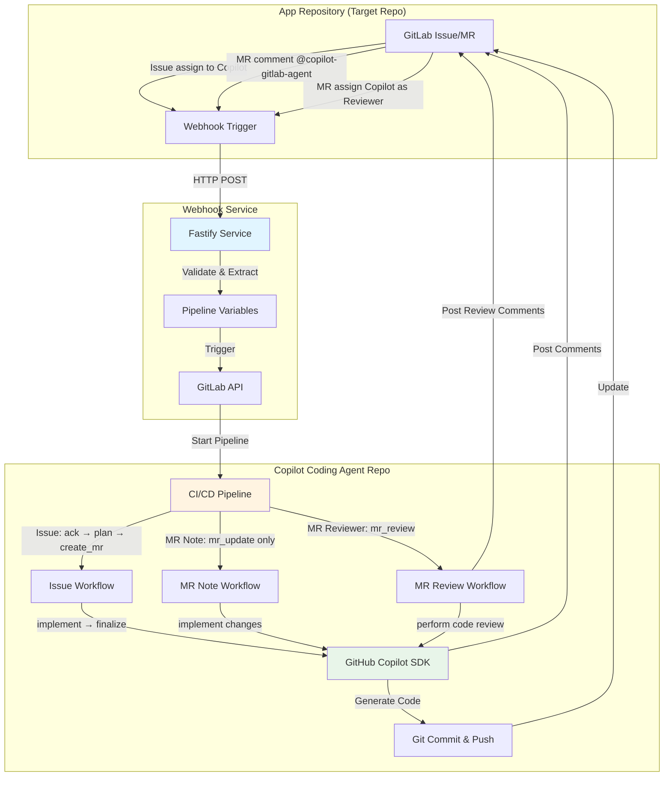

# GitLab용 Copilot 코딩 에이전트

[English](../README.md) | [中文](./README_CN.md) | [日本語](./README_JA.md) | [हिन्दी](./README_HI.md) | 한국어 | [ภาษาไทย](./README_TH.md) | [العربية](./README_AR.md)

GitHub Copilot SDK와 GitLab CI/CD로 구동되는 완전 자동화된 코딩 에이전트입니다. 이 시스템은 issue 할당, merge request 댓글, merge request 리뷰어 할당을 통해 자율적인 코드 구현과 지능형 코드 검토를 가능하게 합니다.

## 데모 및 예시
**Youtube 데모 비디오**

설정:
- [Copilot Coding Agent for GitLab - Setup Guide](https://www.youtube.com/watch?v=aSQVP1AAD60)

사용 방법:
- [Copilot Coding Agent for GitLab - How to use 2:30 – Create an issue in the app repo and assign it to Copilot](https://www.youtube.com/watch?v=med7Bfff_m4&t=150s)
- [Copilot Coding Agent for GitLab - How to use 11:24 – Let Copilot make some updates in the merge request via comments](https://www.youtube.com/watch?v=med7Bfff_m4&t=684s)

**예시 리포지토리**
- 공개 GitLab 데모 리포지토리 [app-repo-01](https://gitlab.com/agentic-devops/app-repo-01)
- Issue: [하나의 webhook receiver 애플리케이션](https://gitlab.com/agentic-devops/app-repo-01/-/issues/19)
- MR: [하나의 webhook receiver 애플리케이션 (#19)](https://gitlab.com/agentic-devops/app-repo-01/-/merge_requests/24)
- 댓글로 MR 업데이트: [@copilot-gitlab-agent readme 를 한국어로 바꾸다](https://gitlab.com/agentic-devops/app-repo-01/-/merge_requests/24#note_2929985888)
- 코드 검토: [Copilot을 MR의 검토자로 지정](https://gitlab.com/agentic-devops/app-repo-01/-/merge_requests/24#note_2930048092)

## 🏗️ 아키텍처



### 시스템 구성요소

1. **애플리케이션 리포지토리**: 개발이 이루어지는 애플리케이션 코드 리포지토리
2. **Webhook 서비스**: GitLab 이벤트를 캡처하는 Fastify 기반 릴레이 서비스
3. **Copilot 코딩 에이전트 리포지토리**: 코딩 자동화를 실행하는 CI/CD 오케스트레이터

### 워크플로우 개요

**Issue 할당 워크플로우** (완전 자동화):
```
Issue를 Copilot에 할당 → Webhook → 파이프라인 트리거 →
Issue 확인 → TODO 계획 생성 → MR 생성 →
코드 구현 → 변경사항 푸시 → MR 및 Issue 업데이트
```

**MR Note 워크플로우** (빠른 업데이트):
```
MR에서 @copilot-gitlab-agent 댓글 → Webhook → 파이프라인 트리거 →
확인 → 변경사항 구현 → Source 브랜치에 푸시 →
요약 댓글 게시
```

**MR Reviewer 워크플로우** (지능형 코드 검토):
```
Copilot을 MR 리뷰어로 할당 → Webhook → 파이프라인 트리거 →
확인 → 코드 변경사항 분석 → 포괄적 검토 수행 →
상세 검토 댓글 게시
```

## 📋 전제 조건

### 필요한 도구
- API 접근 권한이 있는 **GitLab 계정**
- **GitLab Runner (Docker/Kubernetes executor)** (CI/CD 실행용)
- **GitHub Copilot** 구독 (SDK API 접근용)
- **Docker** (선택사항, webhook 서비스를 컨테이너로 실행하는 경우)

### 필요한 권한
- **애플리케이션 리포지토리**: Maintainer 역할 (webhook 수신 및 MR 생성용)
- **Copilot 코딩 에이전트 리포지토리**: Owner 역할 (CI/CD 구성용)
- **GitLab Personal Access Token** 다음 스코프 포함:
  - `api` (전체 API 접근)
  - `read_repository`
  - `write_repository`

## 🚀 관리자 설정 가이드

### 1단계: Copilot 봇 사용자 생성 (선택사항이지만 권장)
> 더 나은 권한 관리 및 활동 감사를 위해 Copilot 에이전트용 전용 GitLab 사용자 계정을 생성하는 것이 좋습니다. 기존 계정을 사용할 수 있지만 권장하지 않습니다.

1. "Copilot" 또는 유사한 이름으로 새 GitLab 계정 생성
2. 이 계정에 대한 Personal Access Token 생성:
   - **User Settings** → **Personal Access Tokens**로 이동
   - 토큰 이름: `copilot-automation`
   - 스코프: 모든 스코프 선택 (또는 최소한: `api`, `read_repository`, `write_repository`)
   - 토큰을 안전하게 저장
   

3. 이 사용자에게 적절한 권한 부여 (한 가지 접근 방식 선택):
   - **옵션 A (조직 전체 사용 권장)**: GitLab **관리자** 또는 그룹 **소유자**로 설정
     - 이를 통해 Copilot 사용자가 GitLab 인스턴스 또는 그룹의 모든 리포지토리에 접근 가능
     - 여러 프로젝트 관리에 더 편리
   - **옵션 B (제한된 범위 권장)**: 특정 애플리케이션 리포지토리에 멤버로 추가
     - 역할: **Developer** 또는 **Maintainer**
     - 더 세밀한 제어, 제한된 접근을 선호하는 경우 적합
   - 이 사용자는 issue에 할당되고 merge request를 생성합니다

### 2단계: Copilot 코딩 에이전트 리포지토리 설정
> Copilot 사용자 작업 사용

1. **Git URL을 통해 이 리포지토리를 GitLab으로 가져오기**
   - 1단계에서 생성한 Copilot 사용자를 리포지토리 소유자로 사용한 다음 GitLab으로 리포지토리 가져오기:
     ```bash
     https://github.com/trycatchkamal/gitlab-copilot-agent.git
     ```
      
      
      
   - 새로 가져온 리포지토리의 가시성은 Internal로 설정해야 합니다
      

2. **CI/CD 변수 구성**

   **Settings** → **CI/CD** → **Variables**로 이동하여 다음을 추가:

   | 변수 | 설명 | Protected | Masked |
   |----------|-------------|-----------|--------|
   | `GITLAB_TOKEN` | Personal access token (1단계에서) | ✅ | ✅ |
   | `GITHUB_TOKEN` | 유효한 GitHub Copilot 구독을 포함한 GitHub Copilot SDK 접근 토큰 | ✅ | ✅ |

   "Copilot Requests" 권한이 활성화된 fine-grained PAT인 `GITHUB_TOKEN`을 생성하려면:
   - https://github.com/settings/personal-access-tokens/new 방문
   - "Permissions" 아래에서 "add permissions"를 클릭하고 "Copilot Requests" 선택
   - 토큰 생성
   


   

   파이프라인 변수를 사용할 수 있는 역할을 Developer로 변경하는 것을 잊지 마세요
   

3. **GitLab Runner 설정**
   > GitLab 인스턴스에 Docker/Kubernetes executor가 있는 사용 가능한 Runner가 이미 있는 경우 이 단계를 건너뛸 수 있습니다.

   다음과 같이 구성된 GitLab Runner가 있는지 확인:
   - Docker executor (권장)
   - Docker 이미지 접근: `node:20-alpine`

   태그를 사용하는 경우 Runner에 해당 태그가 있는지 확인하거나 필요에 따라 `.gitlab-ci.yml`을 업데이트하세요. 새 Runner 등록은 GitLab의 페이지 안내를 따라 완료할 수 있으며 프로젝트 또는 그룹 수준에서 등록할 수 있습니다. 다음은 프로젝트 수준의 예입니다:
   

### 3단계: Webhook 서비스 배포

1. **`.env` 파일 생성**
   ```bash
   cat > .env << EOF
   PIPELINE_TRIGGER_TOKEN=your-trigger-token, 2단계에서 생성한 리포지토리의 Settings → CI/CD → Pipeline trigger tokens에서 생성
   PIPELINE_PROJECT_ID=your-project-id, 이 리포지토리의 프로젝트 ID (Settings → General에서 확인)
   PIPELINE_REF=main
   GITLAB_API_BASE=https://gitlab.com # 필요한 경우 self-hosted 인스턴스로 변경
   WEBHOOK_SECRET_TOKEN=
   COPILOT_AGENT_USERNAME=copilot-gitlab-agent # Copilot 봇의 GitLab ID
   COPILOT_AGENT_COMMIT_EMAIL=33458317-copilot-gitlab-agent@users.noreply.gitlab.com # git commit용 이메일
   LISTEN_HOST=0.0.0.0
   LISTEN_PORT=8080
   ENABLE_INLINE_REVIEW_COMMENTS=true
   COPILOT_LANGUAGE=ko
   COPILOT_MODEL=gpt-4.1
   EOF
   ```

   - `PIPELINE_TRIGGER_TOKEN`: 2단계에서 생성한 리포지토리의 **Settings** → **CI/CD** → **Pipeline trigger tokens**에서 생성됨
   
   - `PIPELINE_PROJECT_ID`: 이 리포지토리의 프로젝트 ID (**Settings** → **General**에서 확인)
   
   - `COPILOT_AGENT_USERNAME`: 1단계에서 생성한 Copilot 봇 사용자의 GitLab ID
   

2. **Docker로 실행**
   ```bash
   docker run -itd \
     --name gitlab-copilot-agent \
     -p 8080:8080 \
     --env-file .env \
     --restart unless-stopped \
     trycatchkamal/gitlab-copilot-agent:latest
   ```
3. **소스에서 실행 (선택사항)**
   ```bash
   git clone https://github.com/trycatchkamal/gitlab-copilot-agent.git
   cd gitlab-copilot-agent/
   pnpm start
   ```
4. **Hook URL**
   webhook 서비스의 공개 URL 얻기, 예:
   - `http://your-server-ip:8080/gitlab-events`

### 4단계: 애플리케이션 리포지토리에서 Webhook 구성
> 일반적으로 Copilot 코딩 에이전트를 사용하려는 개발자는 Copilot 코딩 에이전트 리포지토리에 접근하지 않고 자신의 애플리케이션 리포지토리에서 webhook만 구성하면 됩니다.

1. **애플리케이션 리포지토리** → **Settings** → **Webhooks**로 이동

2. **Webhook 생성**
   - URL: `http://your-server-ip:8080/gitlab-events`
   - Secret Token: (`WEBHOOK_SECRET_TOKEN`과 동일)
   - Trigger: ✅ **Issues events**, ✅ **Comments** (note events), ✅ **Merge request events**
   - **Add webhook** 클릭
   

3. **webhook 테스트**
   - **Test** → **Issue events** 클릭
   - webhook 서비스 로그에서 성공적인 수신 확인
   - HTTP 200/202 응답 확인

### 5단계: 검증

1. **Issue 할당 테스트**
   - 애플리케이션 리포지토리에서 테스트 issue 생성
   - Copilot 사용자에게 할당
   
   - Copilot 코딩 에이전트 리포지토리에서 CI/CD 파이프라인 트리거 확인
   
   - MR 생성 및 코드 구현 확인
   
   

2. **MR Note 테스트**
   - 애플리케이션 리포지토리에서 테스트 MR 생성
   - 댓글: `@copilot-gitlab-agent add a hello world function`
   
   - 파이프라인 실행 및 코드 변경 확인
   

3. **MR Reviewer 테스트**
   - 애플리케이션 리포지토리에서 테스트 MR 생성 또는 열기, Copilot 사용자를 리뷰어로 할당
   
   - 파이프라인 실행 및 검토 댓글 게시 확인, Copilot이 게시한 상세한 코드 검토 보고서 확인
   

4. **로그 확인**
   ```bash
   # Webhook 서비스 로그
   docker logs -f gitlab-copilot-agent

   # 저장된 webhook payload 확인
   ls -la hooks/

   # 파이프라인 로그 확인
   # Copilot 코딩 에이전트 리포지토리 → CI/CD → Pipelines로 이동
   ```

## 📖 사용자 가이드

### 개발자용: Issue 할당 사용

1. **애플리케이션 리포지토리에서 Issue 생성**
   ```markdown
   ## 요구사항
   - 사용자 인증 구현
   - 비밀번호 해싱 추가
   - 로그인 엔드포인트 생성
   - JWT 토큰 생성 추가
   ```

2. **Copilot에 할당**
   - issue 페이지에서 "Copilot" 사용자에게 할당
   - 시스템이 자동으로 작업 시작

3. **진행 상황 추적**
   - Copilot이 파이프라인 링크가 포함된 확인 댓글 게시
   - TODO 체크리스트가 포함된 merge request 생성
   - 코드가 자동으로 구현됨
   - 최종 댓글로 완료 알림

   > **참고**: issue에 대한 merge request가 이미 존재하는 경우 Copilot이 이를 감지하고 issue에 알림을 게시하여 중복 MR을 생성하는 대신 기존 MR에서 작업을 계속하도록 요청합니다.

4. **검토 및 병합**
   - MR에서 생성된 코드 검토
   - 필요한 경우 변경 요청 (아래 MR Note 사용법 참조)
   - 만족스러우면 승인하고 병합

### 개발자용: MR Note 명령 사용

1. **기존 MR에서** 댓글 추가:
   ```
   @copilot-gitlab-agent add error handling to the login function
   ```

2. **지원되는 지시사항**
   - 기능 추가: `@copilot-gitlab-agent add unit tests for authentication`
   - 버그 수정: `@copilot-gitlab-agent fix the null pointer exception in line 45`
   - 리팩토링: `@copilot-gitlab-agent refactor the user service to use dependency injection`
   - 업데이트: `@copilot-gitlab-agent update dependencies to latest versions`

3. **Copilot이 수행**:
   - 요청 확인
   - 변경사항 구현
   - MR 브랜치에 커밋 및 푸시
   - 변경사항 요약 게시

### 개발자용: 코드 검토를 위한 MR Reviewer 사용

1. **MR 페이지에서** Copilot 사용자를 리뷰어로 할당
   - MR 페이지 오른쪽의 "Reviewers" 옵션 찾기
   - Copilot 사용자 선택 (예: copilot-gitlab-agent)

2. **Copilot이 수행**:
   - 코드 검토 워크플로우 자동 트리거
   - source 및 target 브랜치 간 모든 코드 변경사항 분석
   - 다음을 포함한 포괄적인 코드 검토 수행:
     - 코드 품질 및 유지보수성
     - 모범 사례 및 디자인 패턴
     - 보안 취약점 확인
     - 성능 분석
     - 테스트 커버리지 평가
     - 문서 완전성
   - MR에 심각도별로 분류된 상세 검토 보고서 게시
   - 구체적인 개선 제안 및 권장 수정사항 제공

3. **검토 보고서 내용**:
   - 전체 평가 요약
   - 심각도별로 분류된 문제 (Critical, Major, Minor, Suggestions)
   - 각 문제에는 파일 위치, 상세 설명, 수정 권장사항 포함
   - 최종 검토 권장사항: APPROVE, REQUEST_CHANGES, 또는 NEEDS_DISCUSSION

### 모범 사례

**효과적인 Issue 설명 작성**:
- 요구사항에 대해 구체적으로 작성
- 수락 기준 포함
- 맥락과 예시 제공
- 여러 작업에 대해 체크리스트 사용

**MR Note 명령 사용**:
- 댓글당 하나의 명확한 지시사항
- 가능하면 특정 파일/함수 참조
- 간결하지만 설명적으로 작성
- 다음 지시사항 전에 완료 대기

**코드 검토**:
- 생성된 코드 항상 검토
- 구현 테스트
- 보안 문제 확인
- 코딩 표준 준수 확인

## 🔧 구성 참조

### 중간 파일 (Git에서 자동 제외)

다음 파일은 실행 중에 생성되지만 커밋에서 제외됩니다:
- `patch_raw.txt` - 원시 Copilot 출력
- `todo.md` / `todo_completed.md` - 작업 체크리스트
- `plan.json` - 실행 계획
- `commit_msg.txt` - 생성된 커밋 메시지
- `mr_summary.txt` - 변경사항 요약

## 🐛 문제 해결

### Webhook이 트리거되지 않음

1. **webhook 전달 확인**
   - 앱 리포지토리 → Settings → Webhooks → View Recent Deliveries
   - 2xx 상태 코드 확인

2. **webhook 서비스 확인**
   ```bash
   curl -X POST https://gitlab-events.yourdomain.com/gitlab-events \
     -H "Content-Type: application/json" \
     -d '{"test": true}'
   ```

## 📁 프로젝트 구조

```
.
├── src/
│   ├── __tests__/                     # 테스트 파일
│   ├── lib/
│   │   ├── gitlab-api.ts             # GitLab API 클라이언트 (@gitbeaker/rest)
│   │   ├── prompt-loader.ts          # i18n 프롬프트 템플릿 로더
│   │   ├── git-helpers.ts            # Git 유틸리티 함수
│   │   ├── retry.ts                  # 재시도 유틸리티
│   │   ├── issue-workflow-service.ts # Issue 자동화 서비스
│   │   ├── mr-update-service.ts      # MR 업데이트 서비스
│   │   └── mr-review-service.ts      # MR 코드 검토 서비스
│   ├── config.ts                     # Zod 검증이 포함된 설정
│   ├── types.ts                      # TypeScript 타입 및 Zod 스키마
│   ├── extractors.ts                 # 변수 추출 로직
│   ├── pipeline.ts                   # Pipeline 트리거 클라이언트
│   ├── utils.ts                      # 유틸리티 함수
│   ├── gitlab-events-handler.ts      # 메인 webhook 핸들러
│   ├── index.ts                      # 애플리케이션 진입점 (Fastify)
│   ├── issue-workflow-cli.ts         # Issue 워크플로우 CLI (CI/CD 용)
│   ├── mr-update-cli.ts              # MR 업데이트 CLI (CI/CD 용)
│   └── mr-review-cli.ts              # MR 검토 CLI (CI/CD 용)
├── prompts/                          # i18n 프롬프트 템플릿 (en, ar, hi, ja, ko, th, zh)
├── hooks/                            # 저장된 webhook 페이로드
├── logs/                             # 애플리케이션 로그
└── dist/                             # 컴파일된 JavaScript
```

## 🛠️ 기술 스택

- **런타임**: Node.js 20+
- **프레임워크**: Fastify 5
- **언어**: TypeScript (strict 모드)
- **AI SDK**: @github/copilot-sdk
- **검증**: Zod
- **테스트**: Jest + ts-jest
- **HTTP 클라이언트**: Undici (네이티브 Node.js fetch)
- **Git 작업**: simple-git
- **GitLab API**: @gitbeaker/rest
- **로깅**: Pino
- **i18n**: 7개 언어 (en, zh, ja, hi, ko, th, ar)
